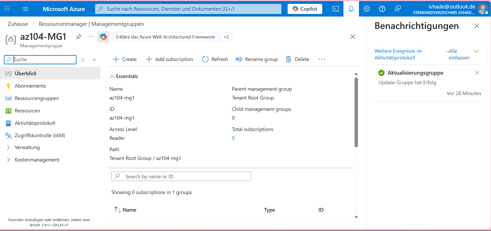
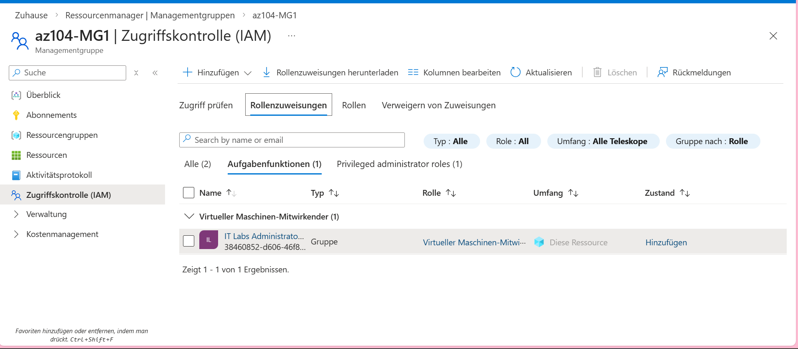
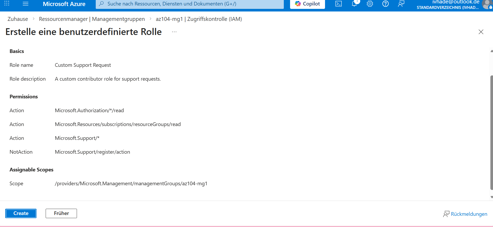

# azure-admin-labs
az-104 lab portfolio: identity, networking, compute, storage, monitoring, governance (scripts, screenshots, cleanup)
# Lab 02 - Managing Subscriptions & RBAC (ENTRA)

## Goal
Understand Azure governancebasics by:
- Creating a management structure(management group/Subscription Scope),
- Reviewing and Assigning RBAC roles at the correct scope,
- Verifying access in the azure portal (and knowing the difference between RBAC roles and Entra Roles).
- Monitoring role assignments with the activity log.

## What I did
- Opened **Subscription** in the Azure portal and reviewd the active portal.
- Created and used a **Resource Group** for this lab.
- Verified my permissions at subscription scope using **Access control (IAM)**.
- Tested the assignment by signing in as the target user (or checking **View access**) and confirming what the user can and cannot do

## Evidence
 - 
 - 
 - 

 