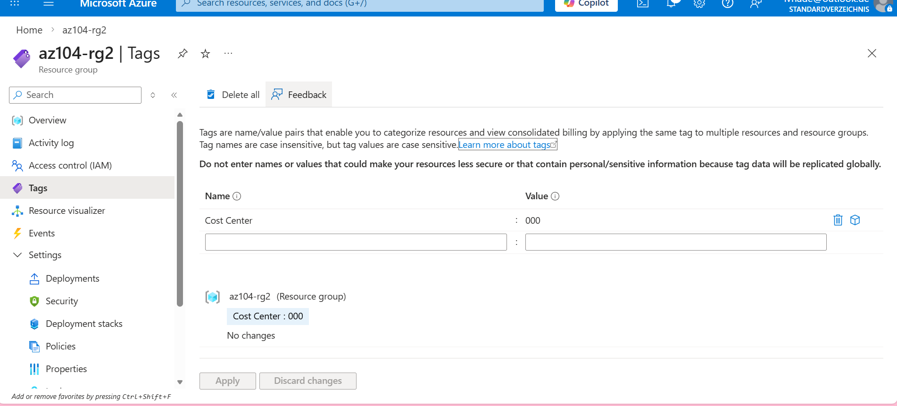
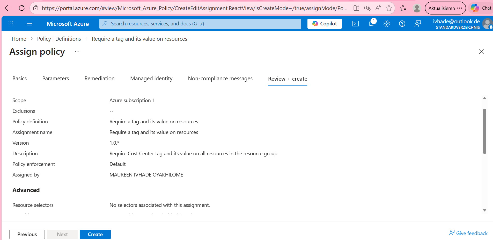
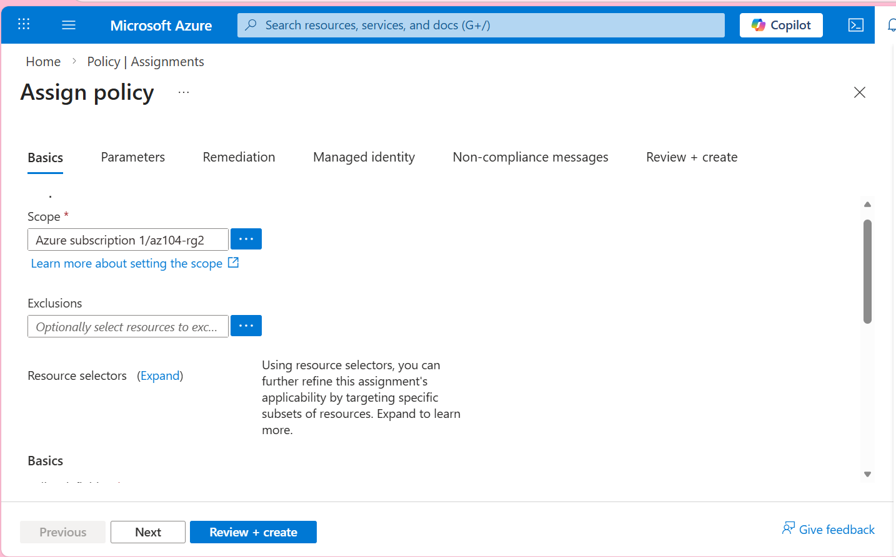
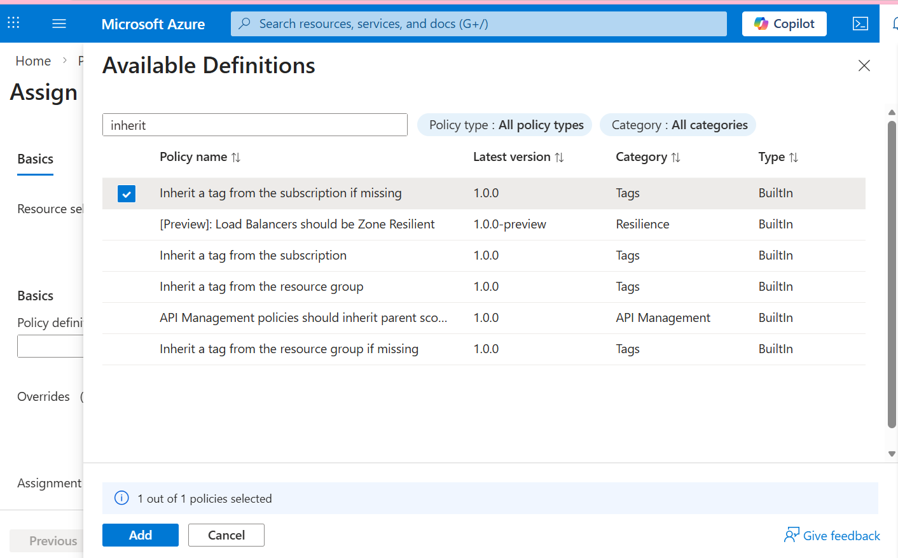
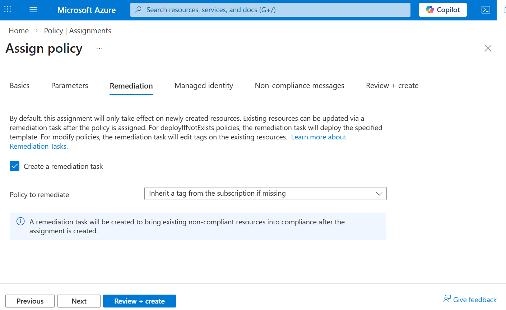
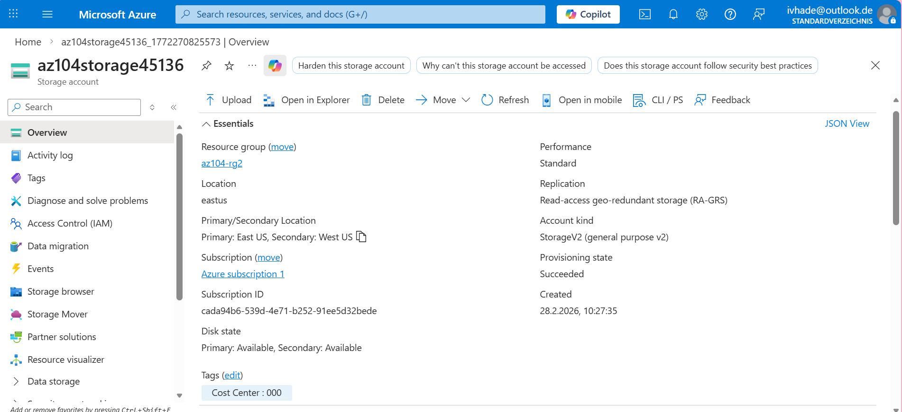
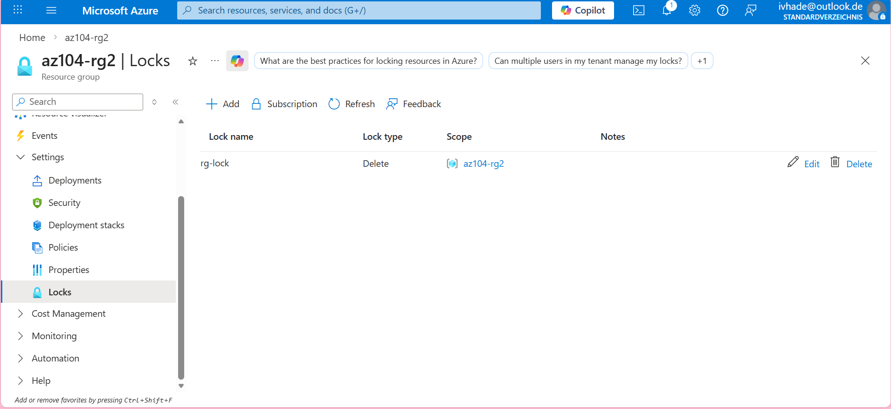
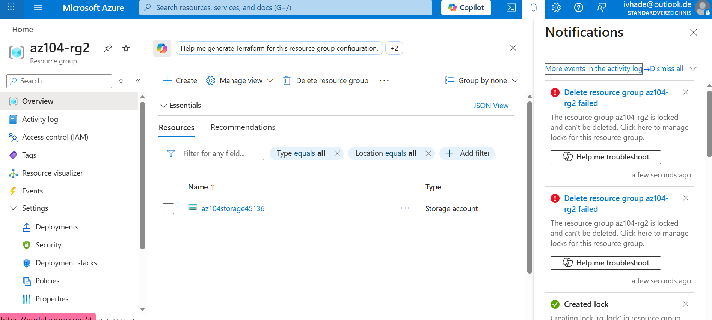

# azure-admin-labs
az-104 lab portfolio: identity, networking, compute, storage, monitoring, governance (scripts, screenshots, cleanup)
# Lab 02 - Manage Governance Via Azure Policy

## Goal
Understand Azure governance basics by:
- Creating and assigning tags via the Azure portal,
- Enforcing tagging via an Azure policy,
- Applying tagging via an Azure policy,
- Configuring and testing resource locks. 

## What I did
- Opened the Azure portal and selected the correct subscription for the lab,
- Created the required tags (tag names and values) in the Azure portal,
- Assigned tags to the target resource/resource groups to standardise tagging,
- Creating or selected an Azure policy that enforces required tags,
- Applied a policy effect to add/apply tagging where applicable and verifies compliance results,
- Configured and tested resource locks to protect resources from accidental changes or deletion.

## Evidence
 - 
 - 
 - 
  - 
 - 
 - 
 - 
 - 
 - 
 - 

 