# azure-admin-labs
az-104 lab portfolio: identity, networking, compute, storage, monitoring, governance (scripts, screenshots, cleanup)
# Lab 03 - Managing Azure Resources Via ARM (Azure Resource Manager) Template

## Goal
Automating and standardising Azure deployments using Infrastructure as Code by:
- Creating an **ARM template** from an Azure deployment (export template),
- Re-deploying the same resources by editing and reusing the ARM template + parameters file.
- Deploying templates through multiple methods. **Azure Portal, Cloud Shell Powershell, Cloud Shell CLI (Bash)**, 
- 

## What I did

## Task 1 - Created an ARM Template
- Created a manages disk in the **Resource Group**
- Opened the disk and selected the **Export template**
- Downloaded **template.json and parameters.json** to my computer,
## Task 2 - Edit the ARM template and redeploy
- Opened and deployed a custom template,
- Loaded **template.json** and edited :
    - renamed the disk name parameter key.
    - changed the disk name value.
- Loaded **parameters.json** and updated the parameters name to match the disk name.
- Redeployed to resource group
- Deployed again into Resource Group and verified the second disk esists 
- Checked **Resource Group -> Deployments** and reviewed inputs/ Template for the deployment,
## Task 3 - Deploy with Cloud Shell (PowerShell)
- Opened **Cloud Shell** and selected ** Powershell**, mounted/created stoage + file share **fs-cloudshell** in resource group,
- Uploaded **template.json + parameters.json** into cloud shell
- Edited the template/parameters to deploy a new managed disk (same configuration, different disk name)
- Ran a **Powershell template deployment** command to deploy the disk from thr files
- Verified the deployment succeeded and confirmed the new disk appeared in the Azure Portal/cloud Shell output.
## Task 4 - Deploy the ARM template with Cloud Shell (Azure CLI/Bash)
- Switched Cloudshell to Bash
- Confirmed the template files were present in the **Cloud Shell** directory
- Update the template/parameters again to deploy another new managed disk
- Ran an **Azure CLI group deployment** command using the template and parameters files
- Verified the deployment succeeded and confirmed the disk was created
## Task 5 - Deploy a resource using Bicep
- Uploaded the **bicep file** to Cloud Shell
- Edited the Bicep File to change the disk settings 
- Ran an **Azure CLI deployment** using **.bicep file
- Verified the deployment succeeded and confirmed the disk was created and visible in Azure

## Evidence
 - 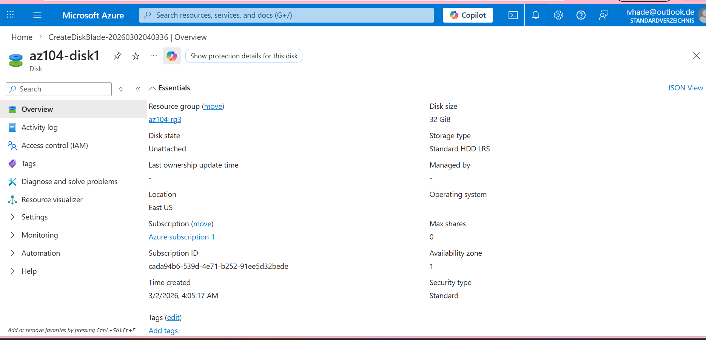
 - 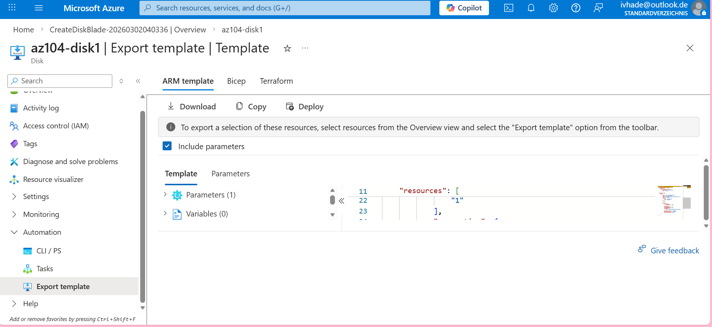
 - 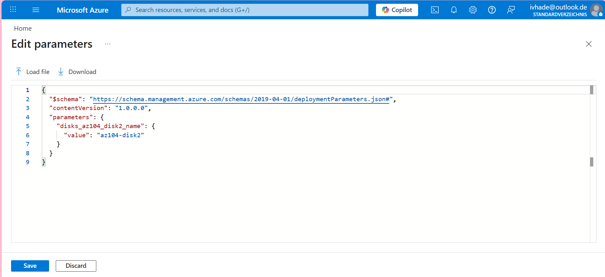
 - 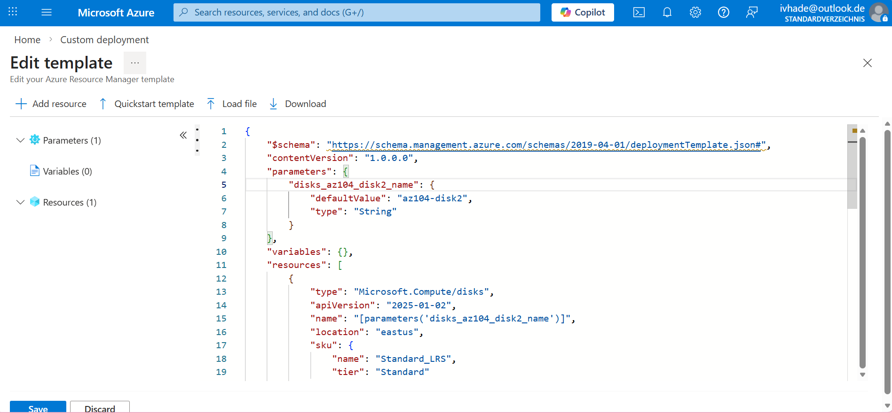
 - 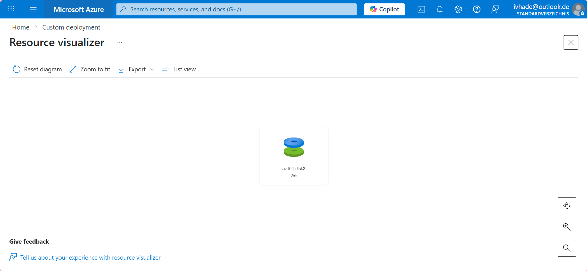
 - 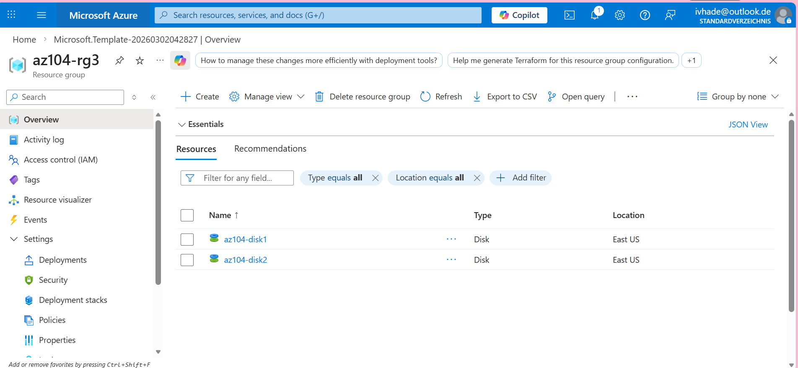
 - 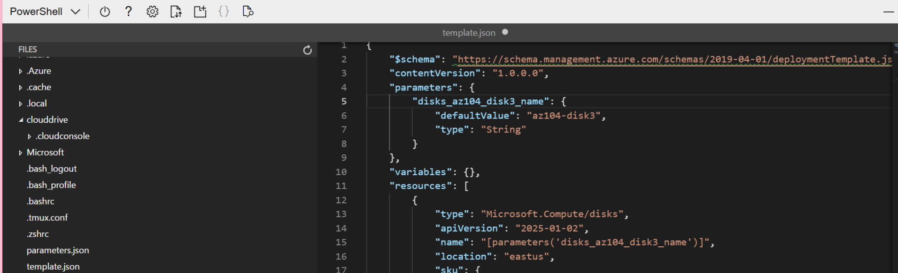
 - 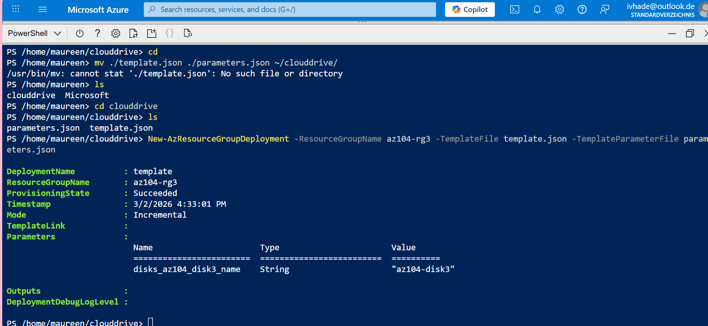
 - 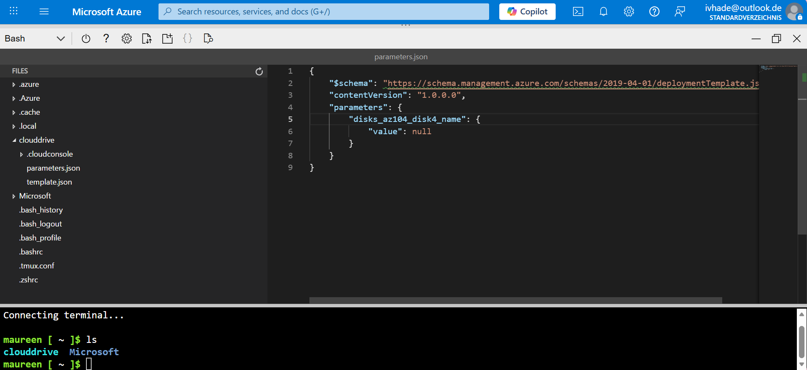
 - 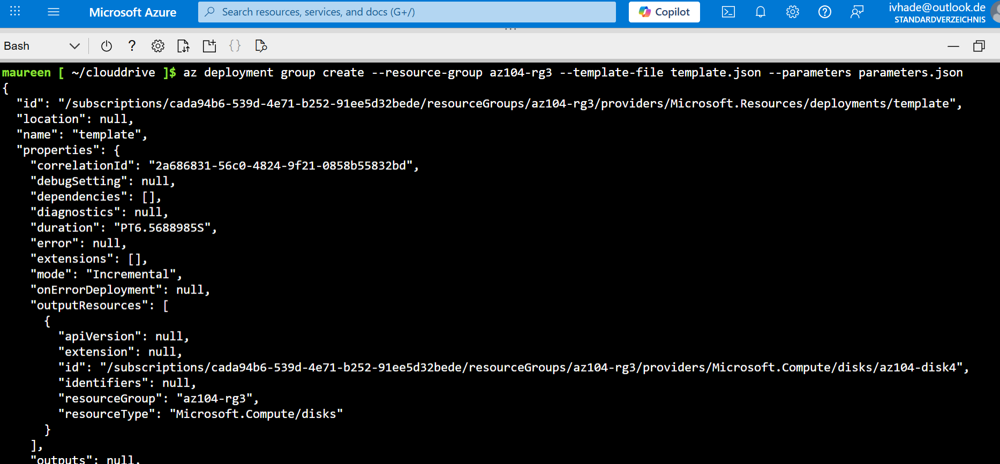
 - 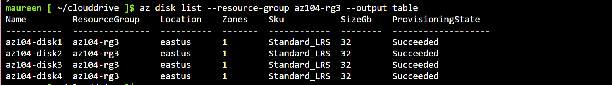
 - 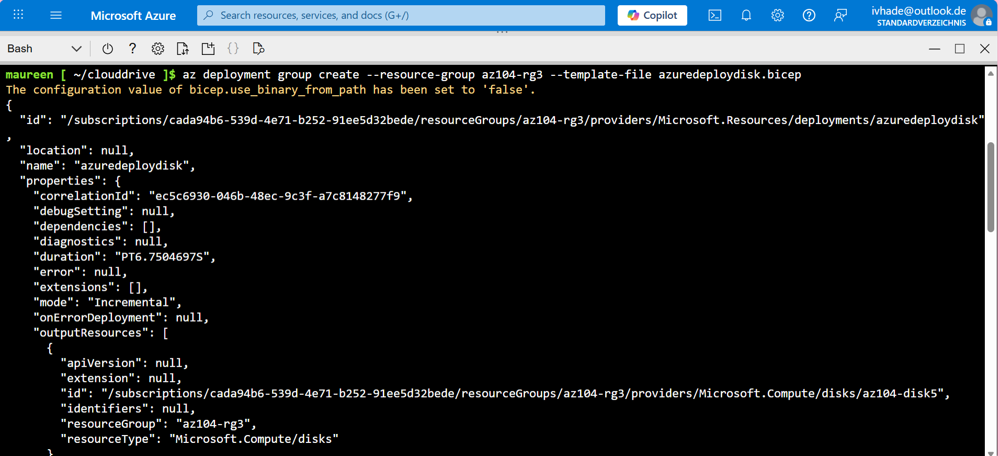
 - 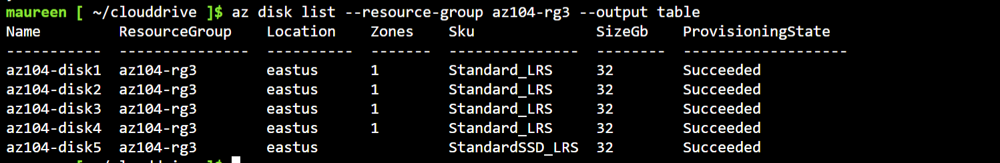
 - 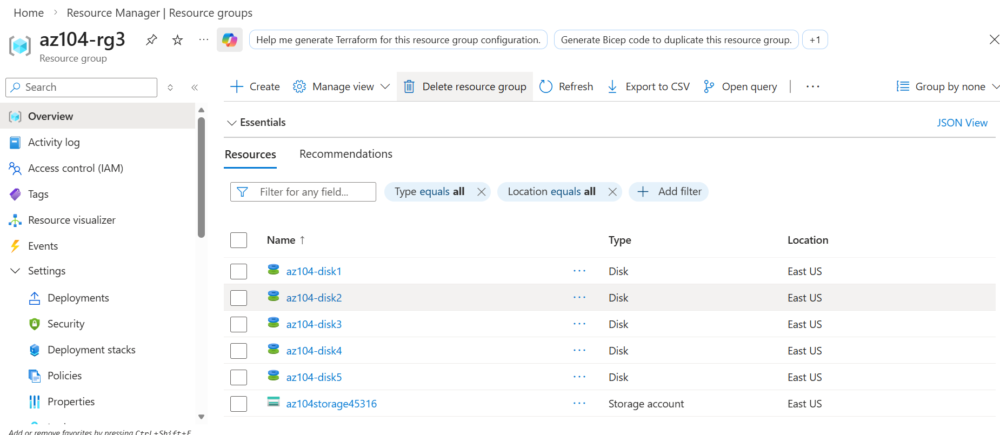

 