# azure-admin-labs
az-104 lab portfolio: identity, networking, compute, storage, monitoring, governance (scripts, screenshots, cleanup)
# Lab 04- Implement Virtual Networking

## Goal
Implementing Virtual Networking by:
- Build and document core Azure virtual networking skills: VNet, subnets, security controls and DNS,
- Practice deploying resources both through the portal and by reusing an exported template,
- Implement basic network segmentation and traffic control using security resources,
- configure name resolution with both public and private DNS to understand how app services 

## What I did
- Created two separate **virtual networks** with non-overlapping address spaces and multiple **subnets** for segmentation,
- Exported an **ARM template** from an existing deployment and reused it to deploy a second, similar network by editing values(names, address ranges and subnet definition),
- Implemented subnet-level security by attaching a **network security policy**  and using an application grouping approach for targeted allow rules,
- Added **inbound rules** to permit required web traffic while restricting outbound internet access to demonstrate governance and control,
- Set up a **public DNS zone** with an **A record** and verified resolution using a **DNS lookup*,
- Set up a **private DNS zone**, linked it to a virtual network, created private records, and validated private name resolution.

## Evidence
 - 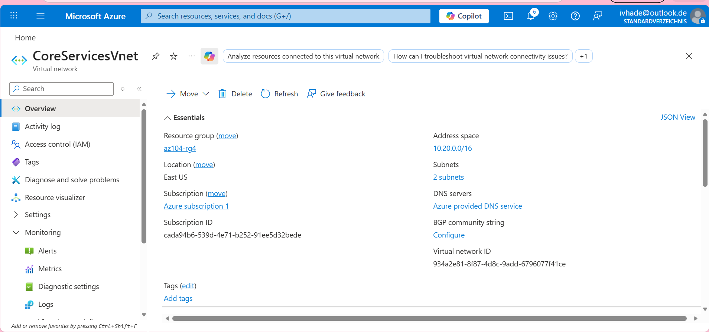
 - 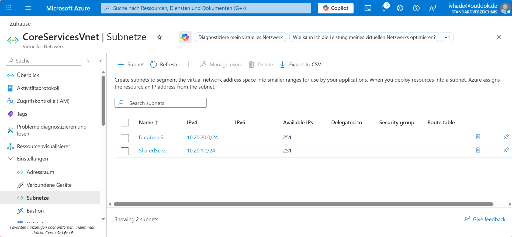
 - 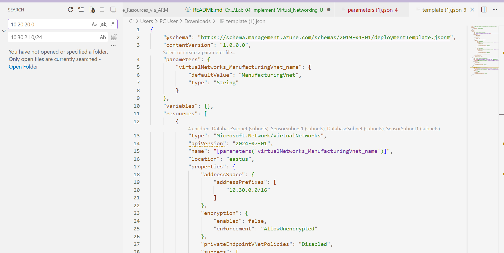
 - 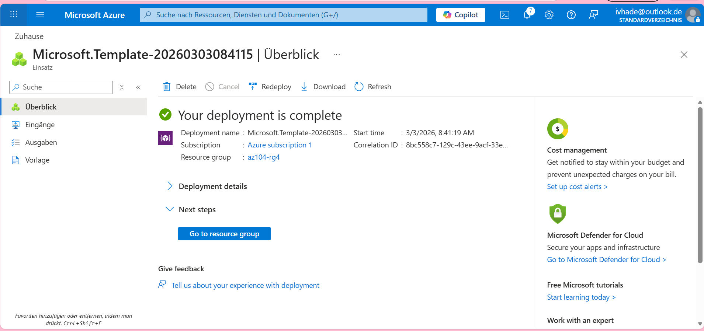
 - 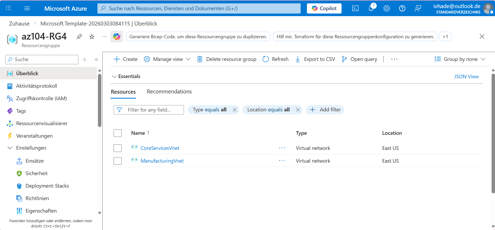
 - 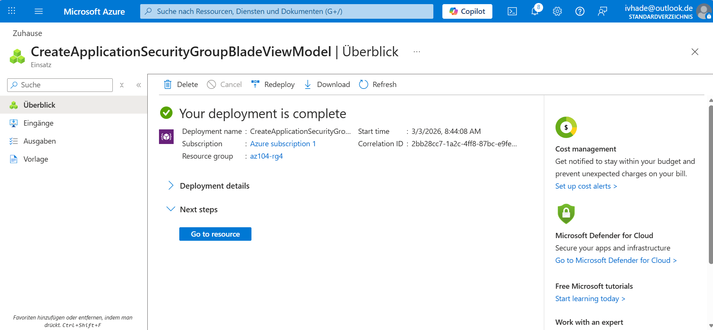
 - 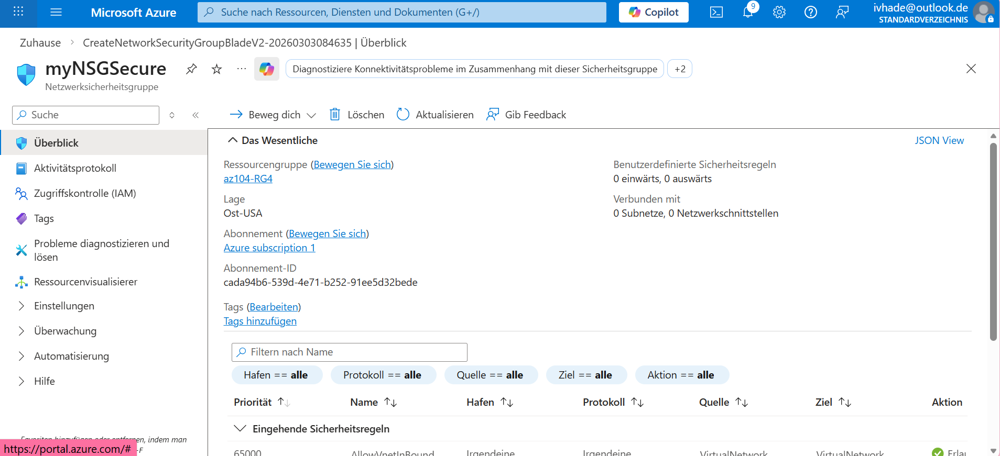
 - 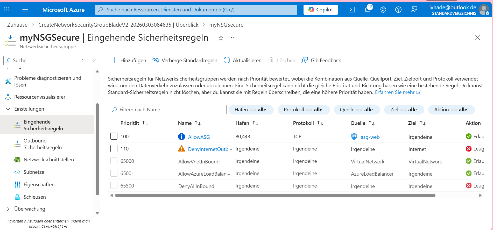
 - 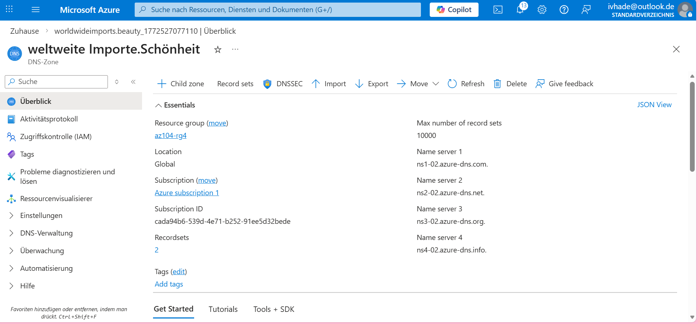
 - 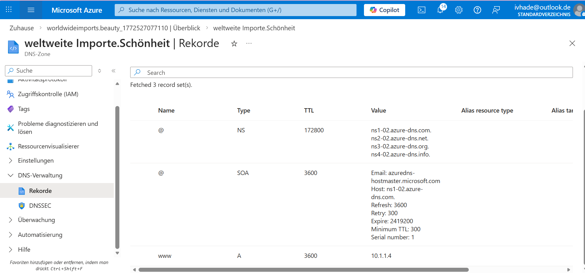
 - 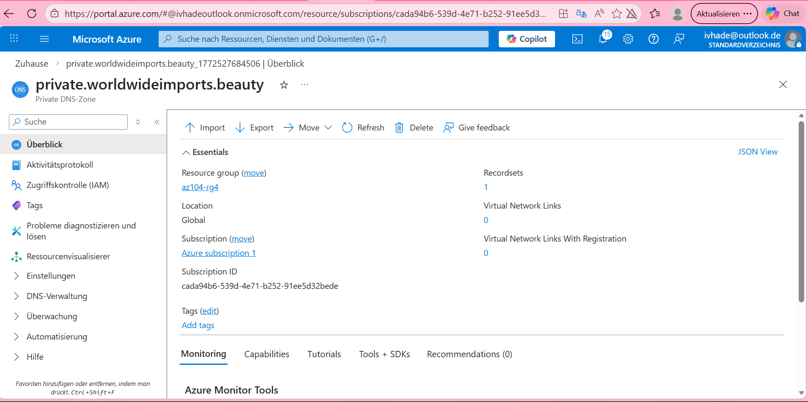
 - 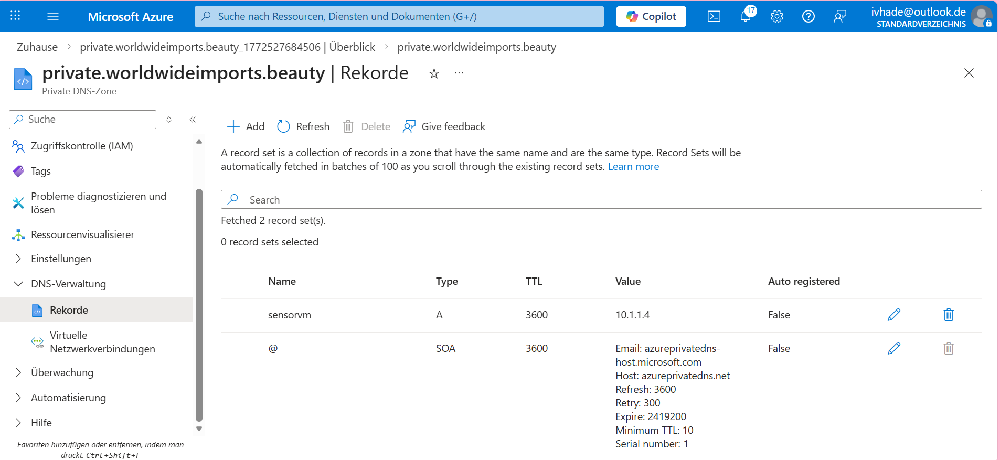
 - 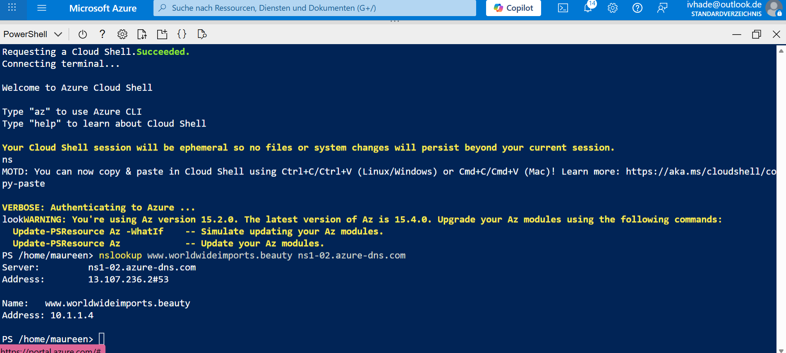
 - 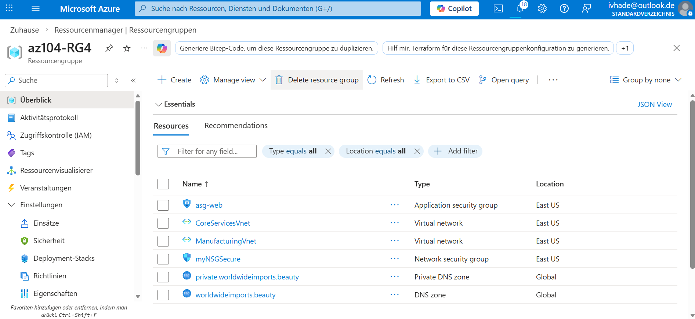

 