# azure-admin-labs
az-104 lab portfolio: identity, networking, compute, storage, monitoring, governance (scripts, screenshots, cleanup)
# Lab 04- Implement Intersite Connectivity

## Goal
Implementing Intersite Connectivity by:

- Deploying workloads into two separate **virtual networks** without overlapping IP ranges.
- Validating connectivity before and after peering using built-in troubleshooting tools.
- Configuring **virtual network peering** to enable private routing across vnets.
- Verifying connectivity with network test (port level) using **powershell**.
- Implementing a custom route using **route table** to control traffic flow via a future appliance hop.

## What I did
- Created 2 **virtual machine** in 2 **virtual networks**.
- Used **network watcher** to test connectivity between virtual machines.
- Configured **virtual network peerings** between the **virtual networks**.
- Used **Azure Powershell** to test the connectivity between the virtual machines.
- Created a custom route and associated it to the **target subnet**

## Evidence
 - 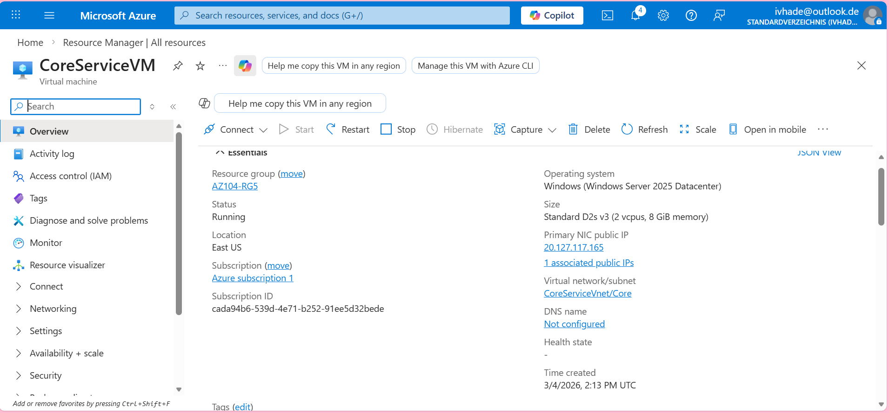
 - 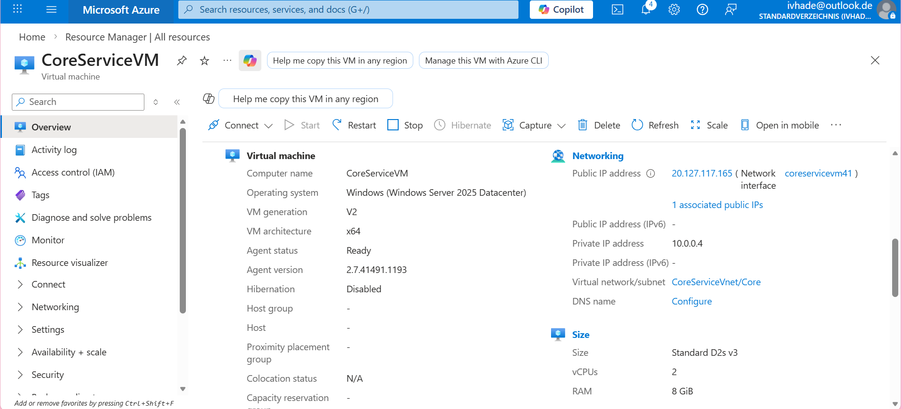
 - 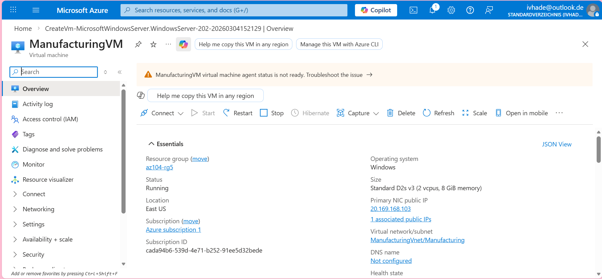
 - 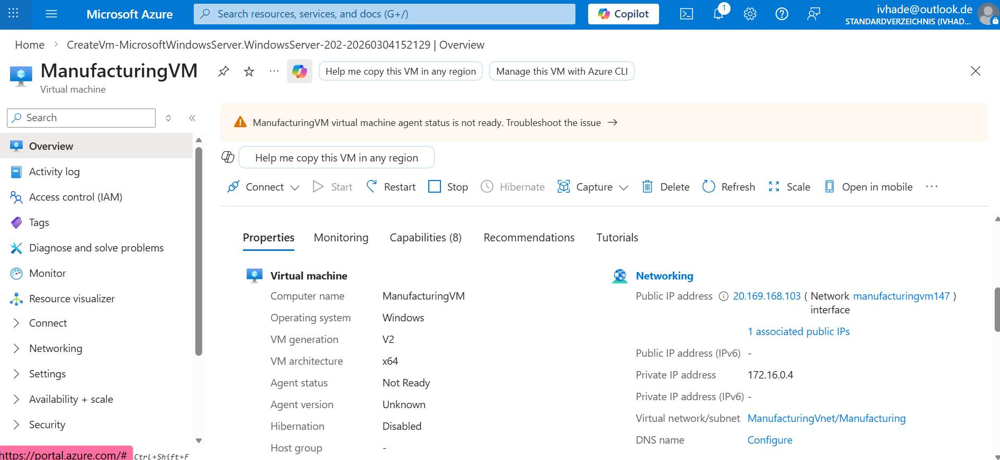
 - 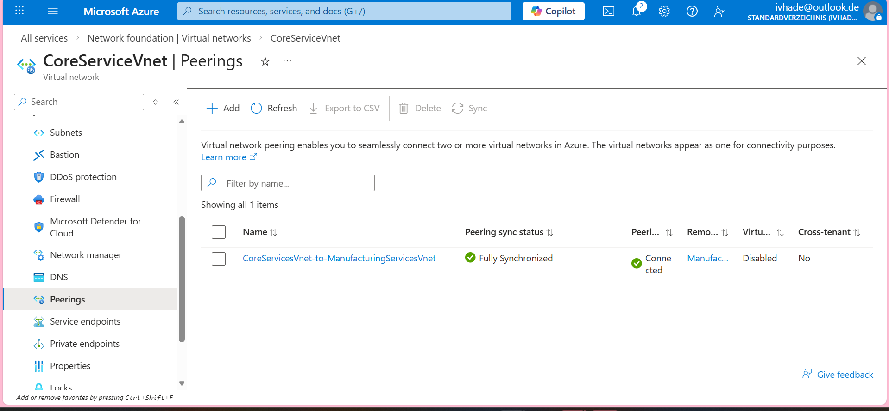
 - 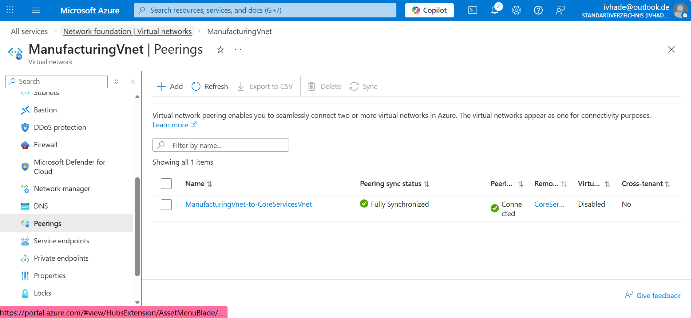
 - 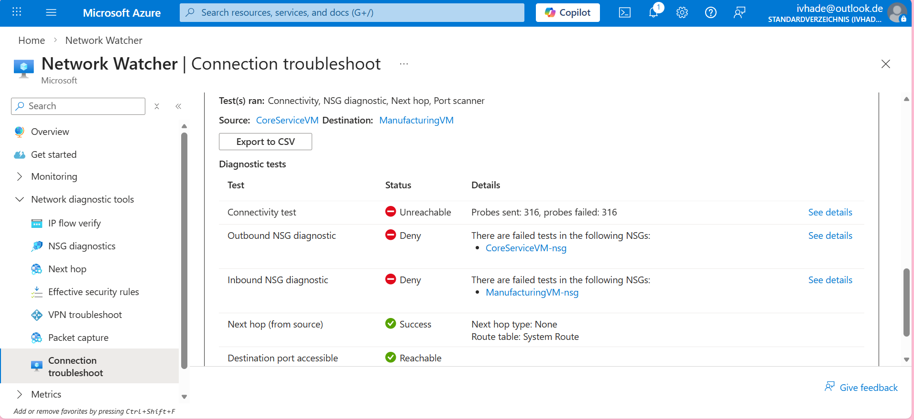
 - 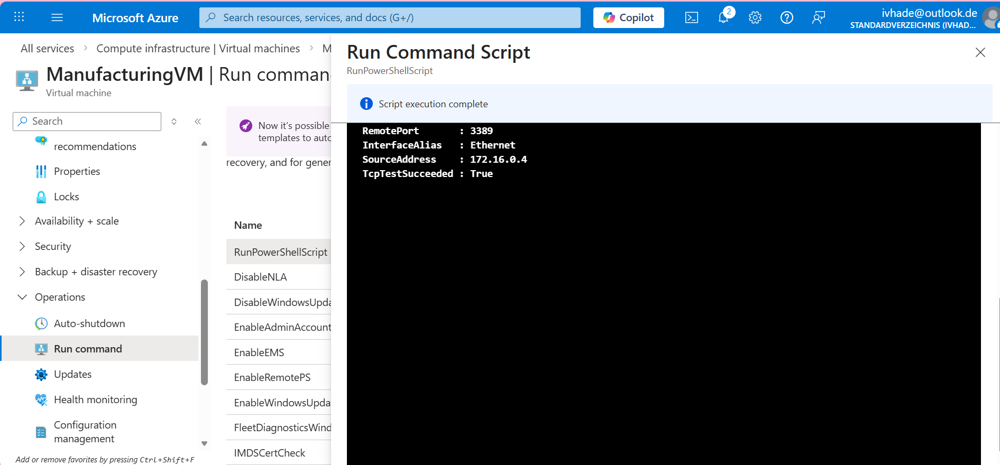
 - 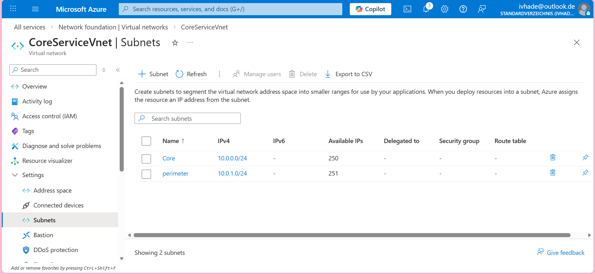
 - 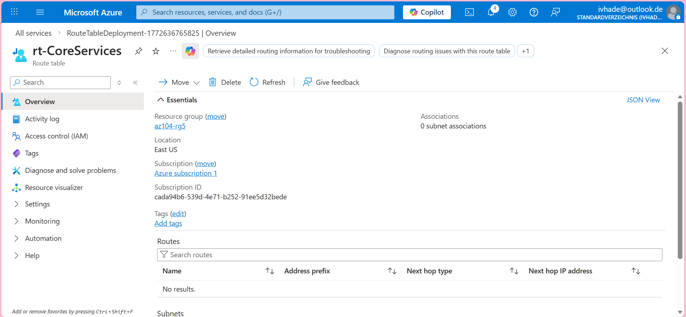
 - 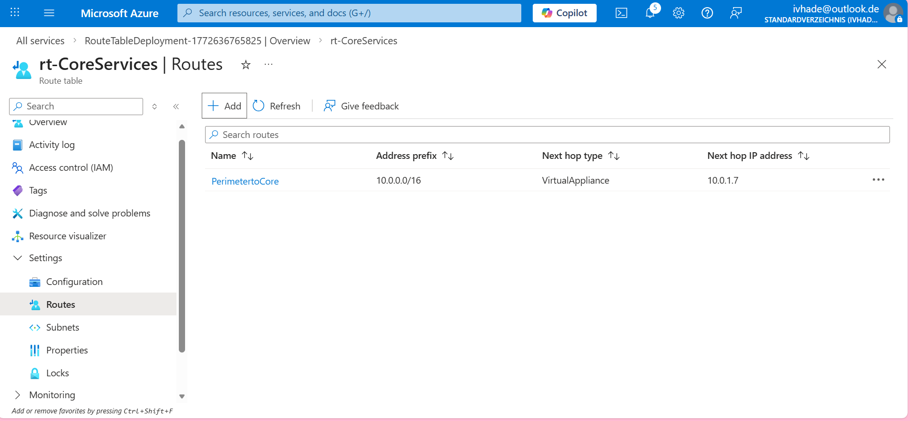
 - 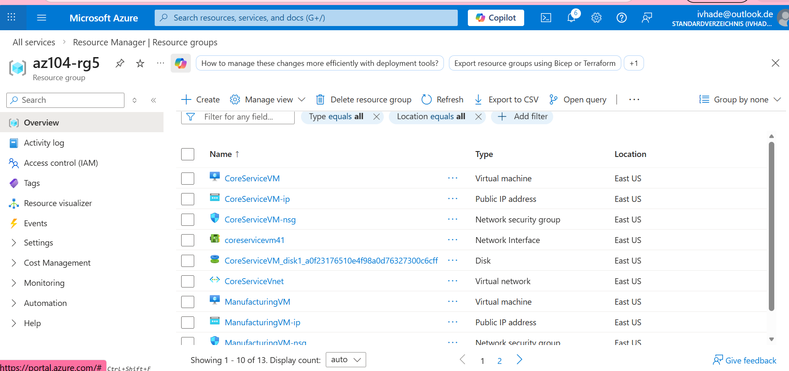
 - 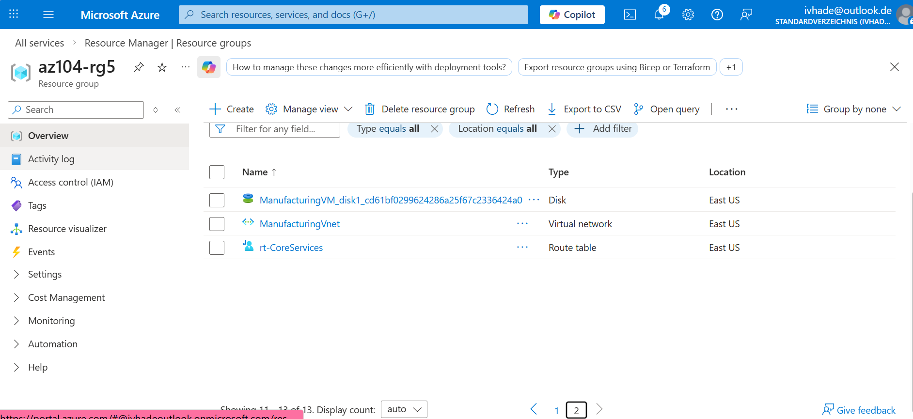
 
