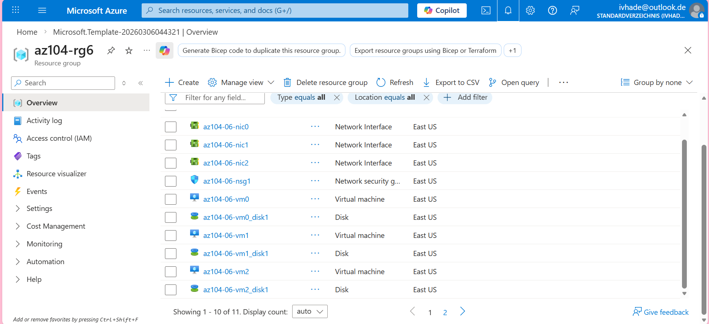
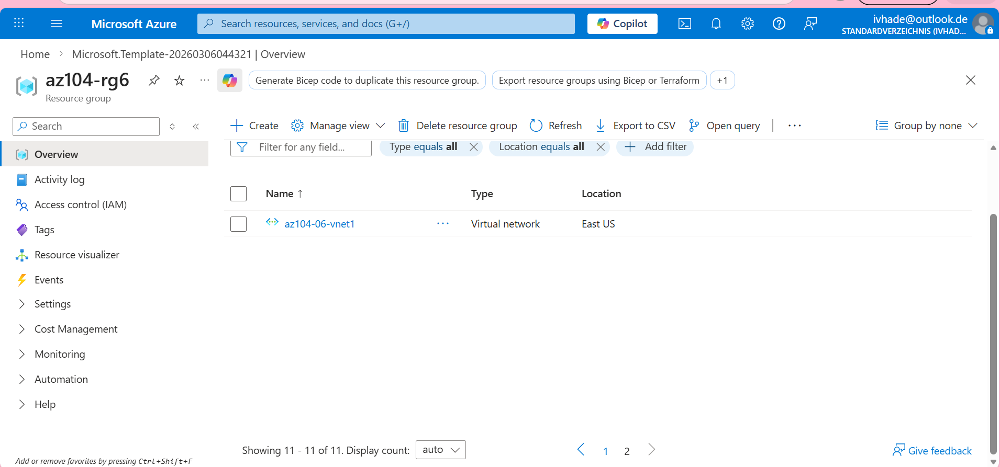
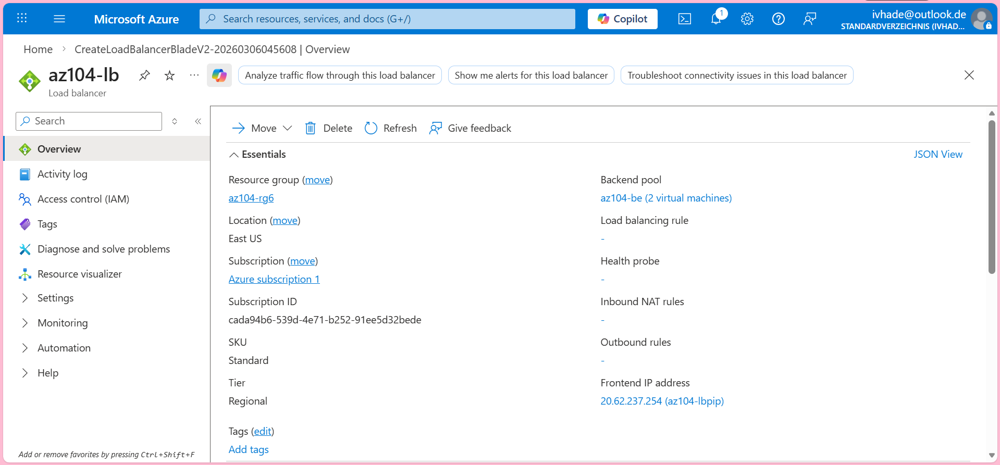
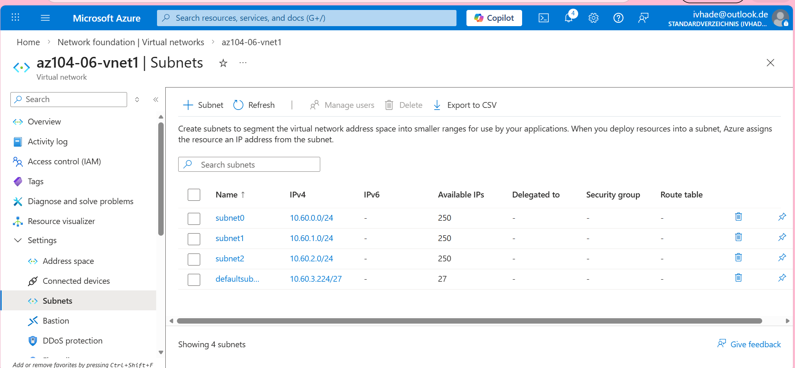
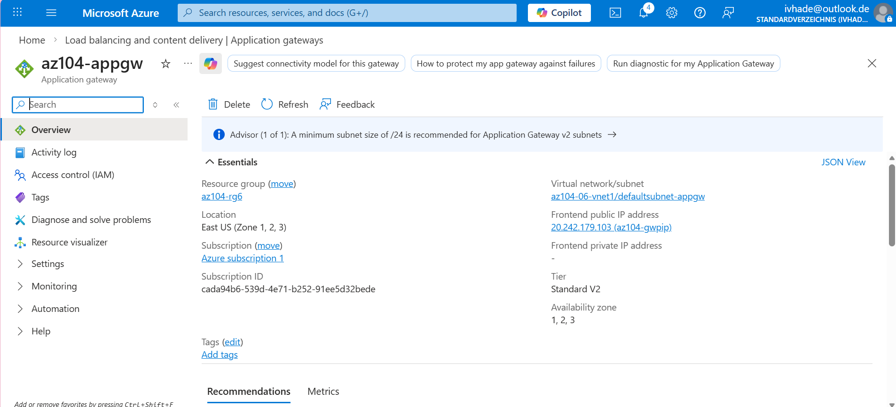
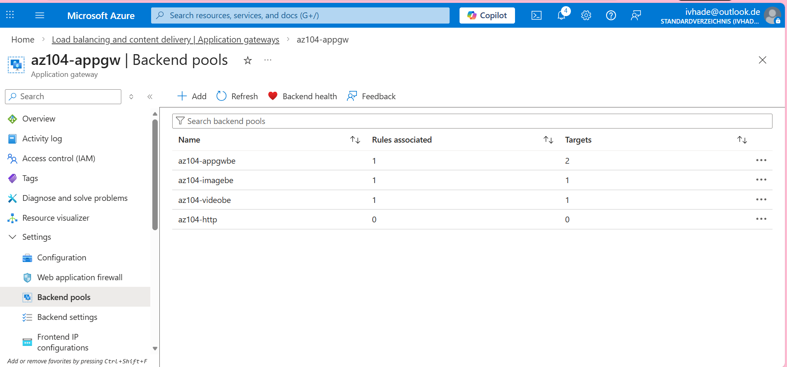
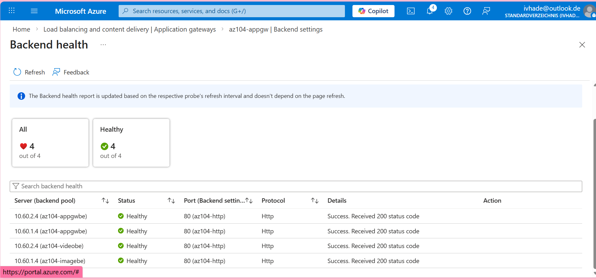

# azure-admin-labs
az-104 lab portfolio: identity, networking, compute, storage, monitoring, governance (scripts, screenshots, cleanup)
# Lab 06- Implement Network Traffic Management

## Goal
Implement network traffic management for a public web workload by:

- Deploying a small baseline environment from an ARM template (VNet, NSG,VMs).
- Configuring a **public load balancer** to distribute HTTP traffic across multiple VMs.
- configuring an **Application Gateway** to route traffic based on URL paths

## What I did

- Deployed the lab environment via a template.
- created a **public Load Balancer** with frontend IP, backend pool, health probe, and load-balancing rule.
- Verified end-to-end connectivity to the Load Balancer frontend and confirmed traffic distribution across backends.
- Created an **Application GATEWAY** (with required subnet, frontend IP, listener and routing rules).
- Configured backend pools and health probes, then confirmed backends reported healthy.
- Implemented and tested path-based routing to direct requests to the intended backeend targets.
- Performed validation checks.

## Evidence
 - 
 - 
 - 
 - 
 - 
 - 
 - 
 - 
 - 
 - 
 - 
 - 
