# azure-admin-labs
az-104 lab portfolio: identity, networking, compute, storage, monitoring, governance (scripts, screenshots, cleanup)
# Lab 07- Manage Azure Storage

## Goal
Build and validate core Azure Storage skills by:

- Creating and configuring a **Storage Account** with appropriate performance and redundancy options,
- Managing **Blob Containers** and **blob access tiers** for cost performance control,
- Creating and managing **File Shares** and validating basic access,
- Reviewing monitoring and data protection options relevant to storage operations.

## What I did

- Created a **Resource Group** for the lab and deployed a new **Storage Account** with the required region and redundancy settings,
- Reviewed key storage account configuration area (networking/access, security, data protection) to understand default and recommended settings,
- Created a **Blob Container**, uploaded test blobs, and verified access and properties in **Storage Browser**,
- Changed/verified **blob access tiers** to demonstrate cost optimization behaviour,
- Generated an **Azure Files Share, added sample files, and confirmed the share contents via portal/Storage Browser,
- Validate that all created resources appeared correctly in the Storage account. 
- Created a virtual network to restrick access to the **Storage Account**

## Evidence
 - 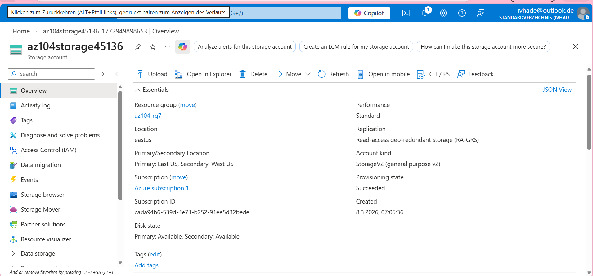
 - 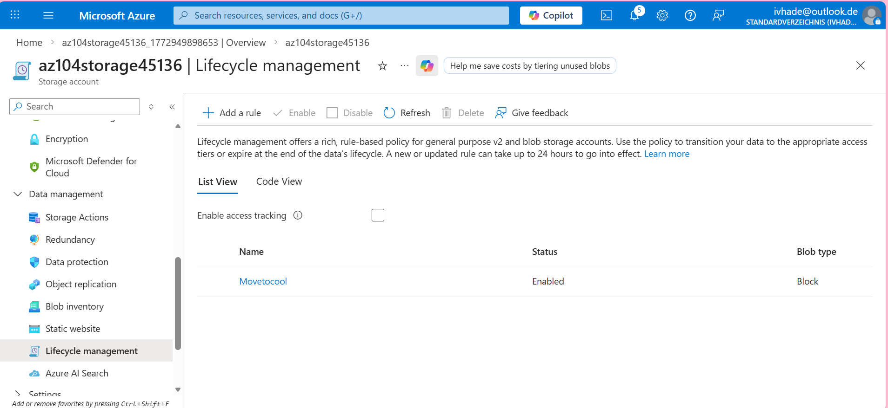
 - 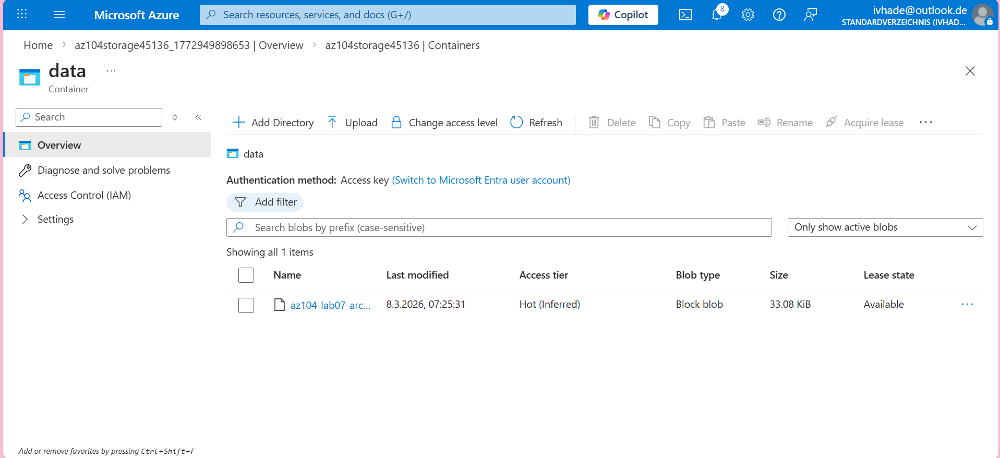
 - 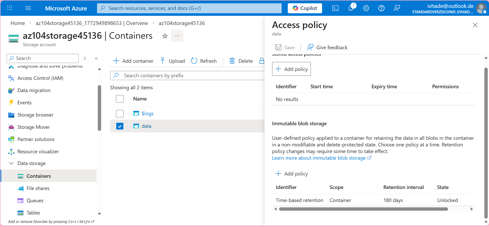
 - 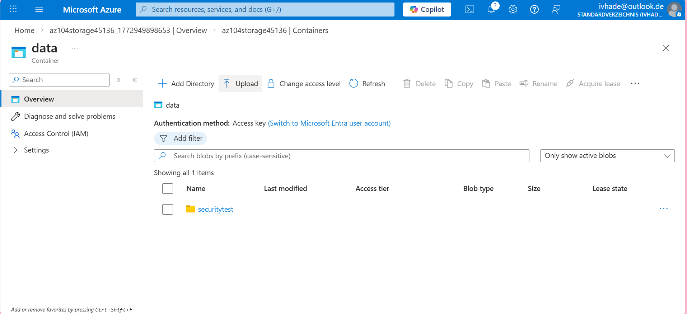
 - 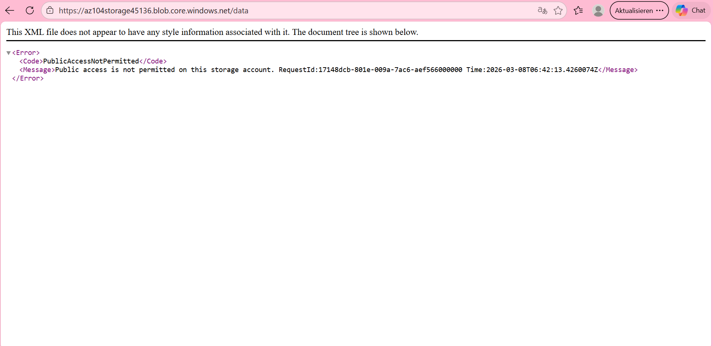
 - 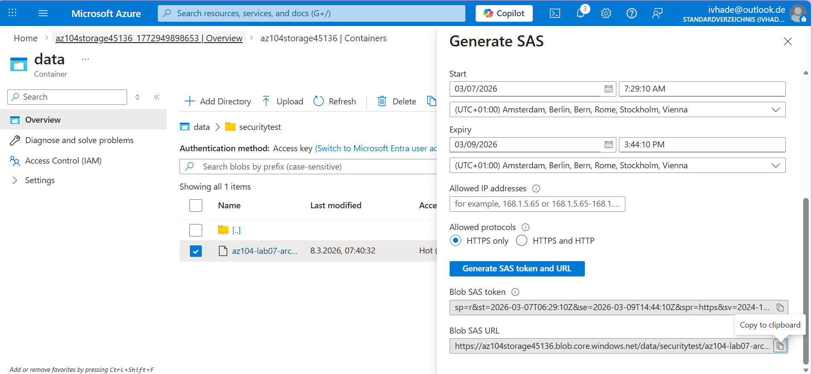
 - 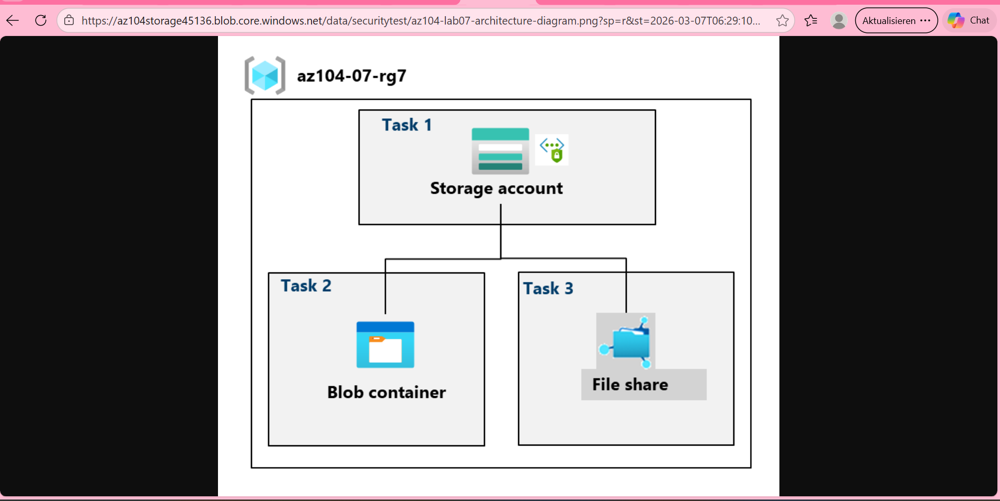
 - 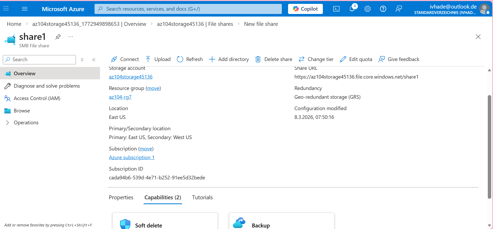
 - 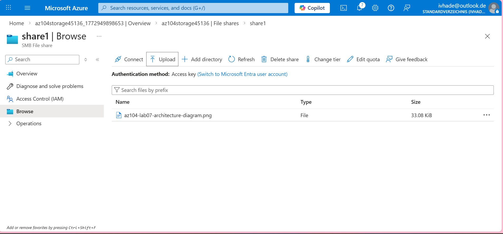
 - 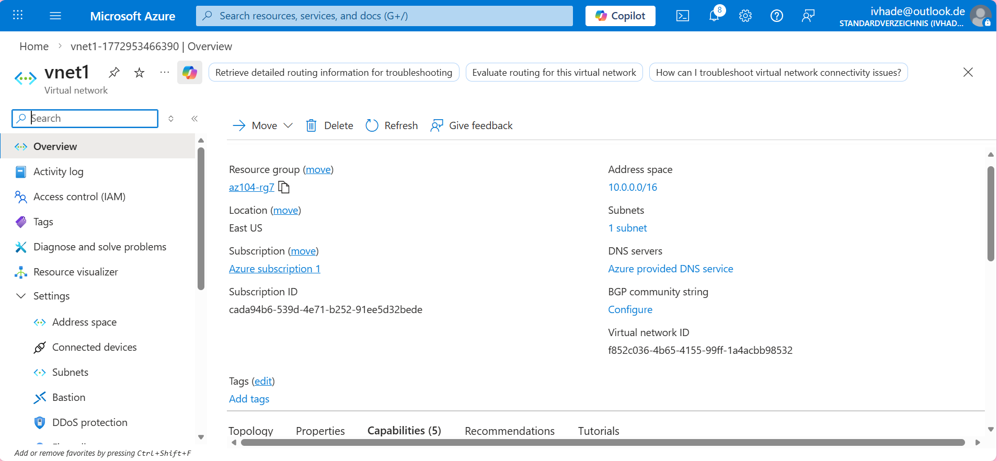
 - 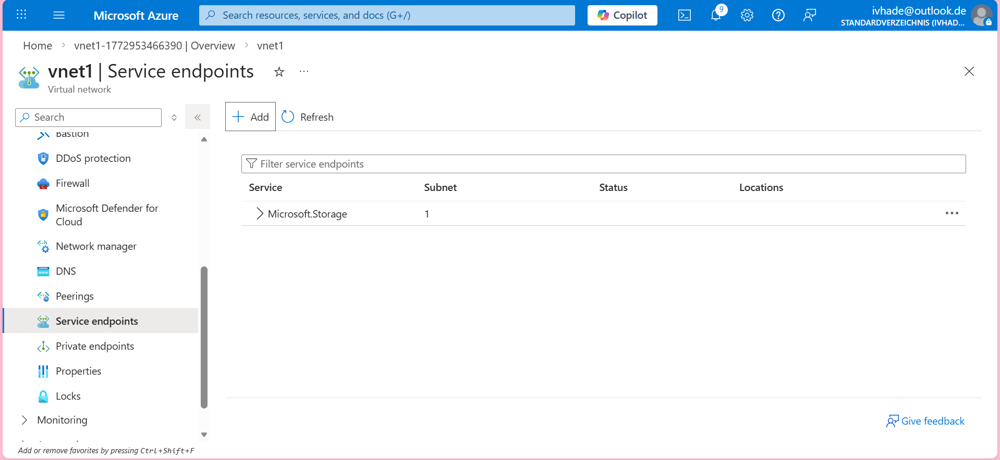
 - 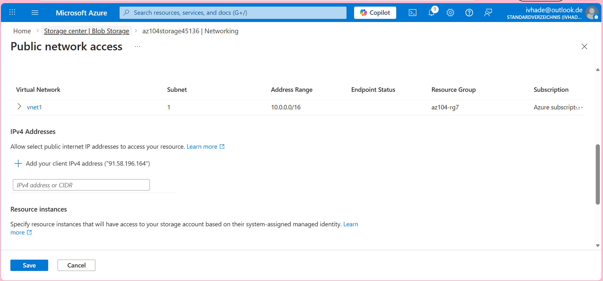
 - 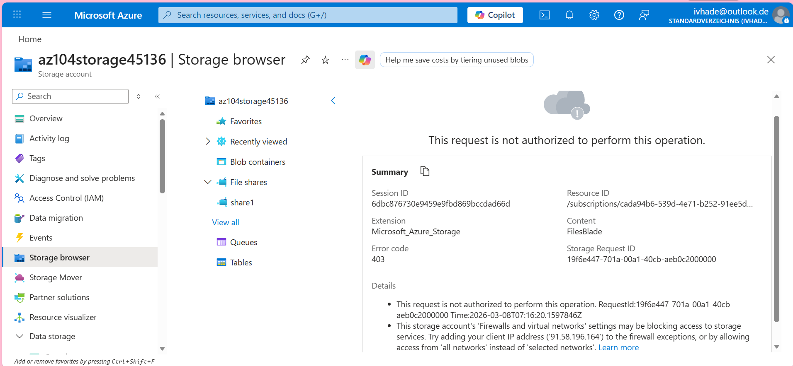