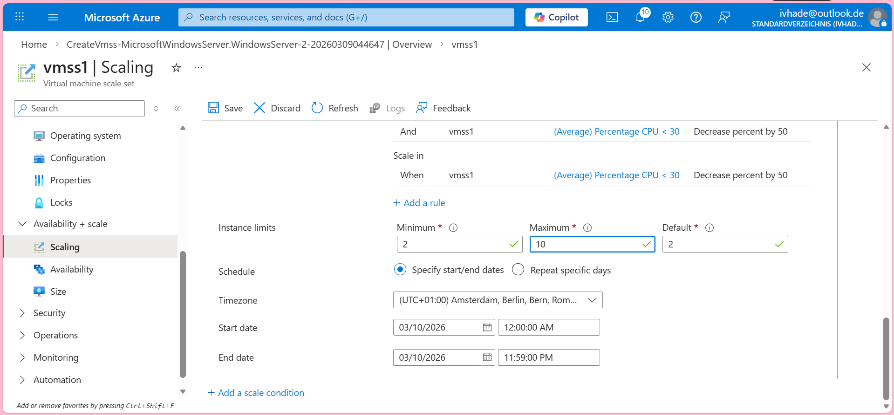
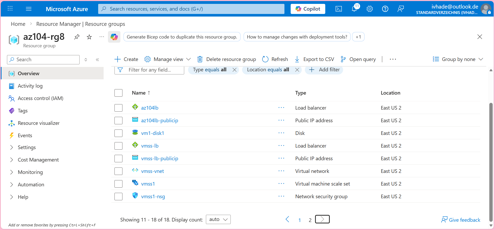
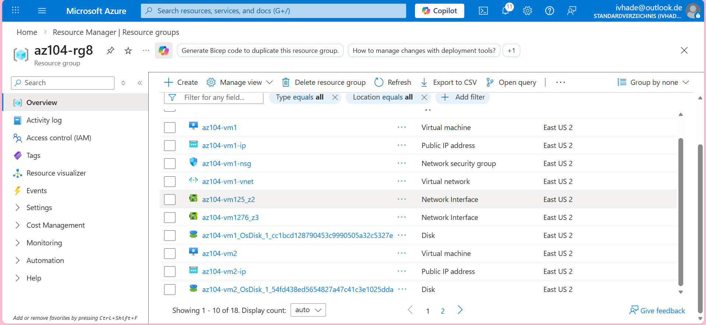

# azure-admin-labs
az-104 lab portfolio: identity, networking, compute, storage, monitoring, governance (scripts, screenshots, cleanup)
# Lab 08- Manage Virtual Machines

## Goal
Build practical virtual machine administration skills by:

- Provisioning and validating a windows virtual machine deployment,
- Managing virtual machine lifecycle operations, sizing, and basic configuration,
- Applying virtual machine management features such as extensions/run commands for post development setup,
- Reviewing performance/health signals and operational readiness for a virtual machine overload.

## What I did

- Deployed a **Windows** virtual machine in the Azure portal and verified its success,
- confirmed core configuration items such as resource placement, networking attachment, access method and validated the **virtual machine** was reachable,
- Performed common lifecycle actions and verified the refletion of such changes,
- Reviewed and adjusted virtual machine settings relevant to its administration,
- Checked monitoring/health indicators to confirm the virtual machine is operating optimally.

## Evidence
- 
- 
- 
- 
- 
- 
- 
- 
- 
- 
- 
- 
- 

