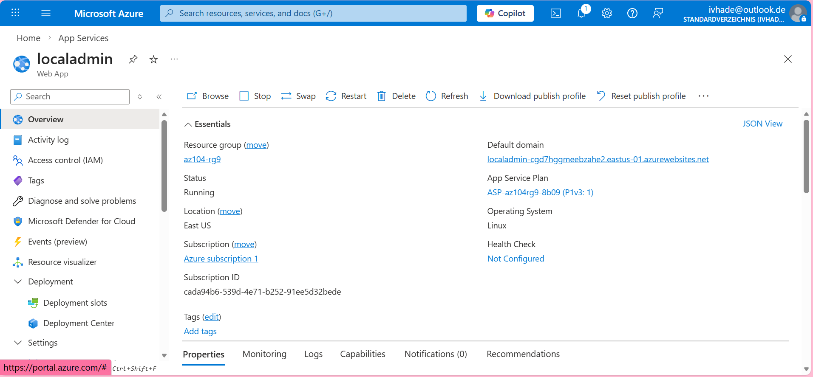
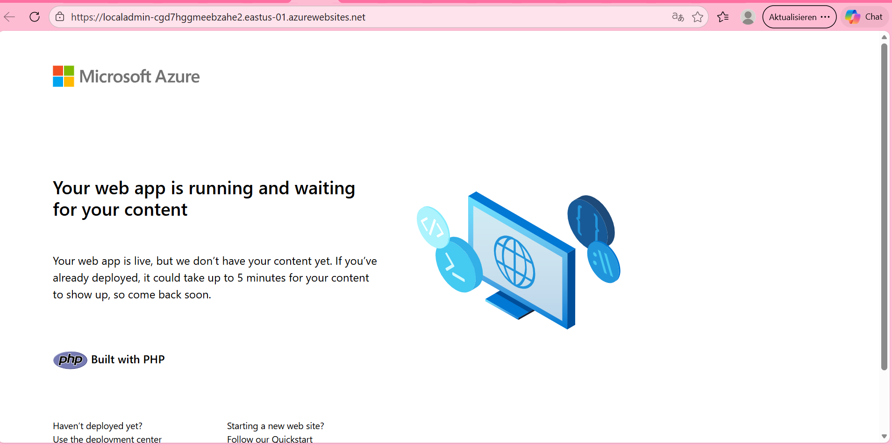
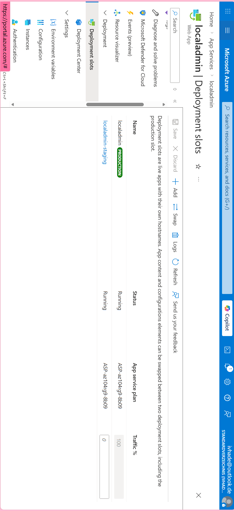
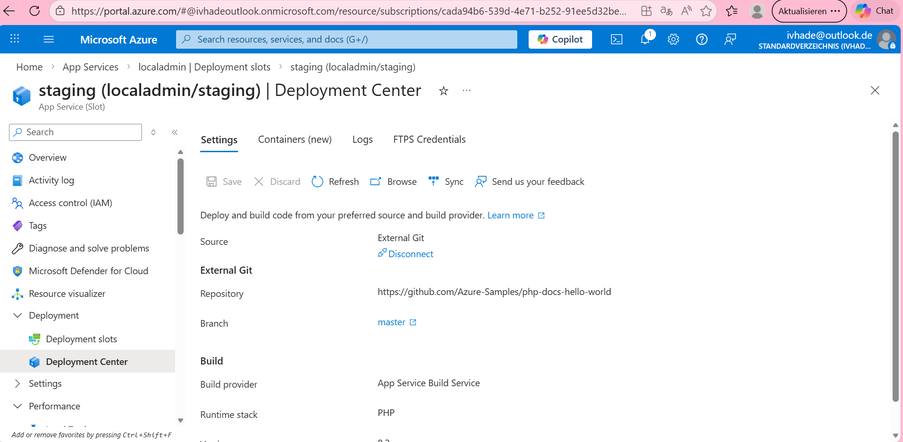
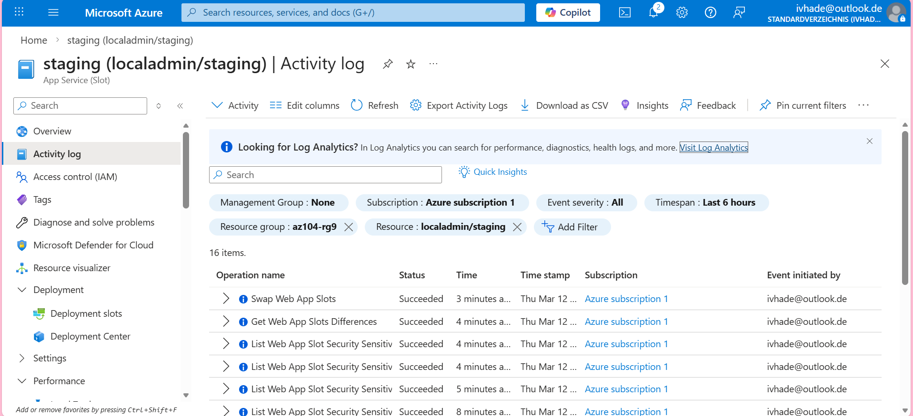
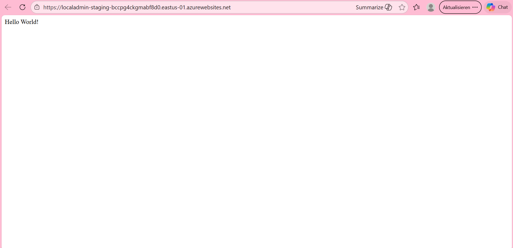
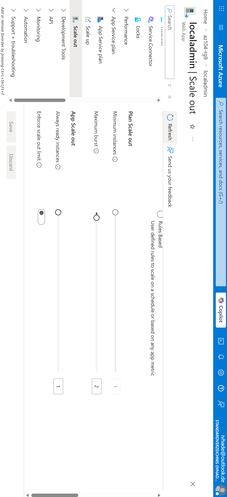
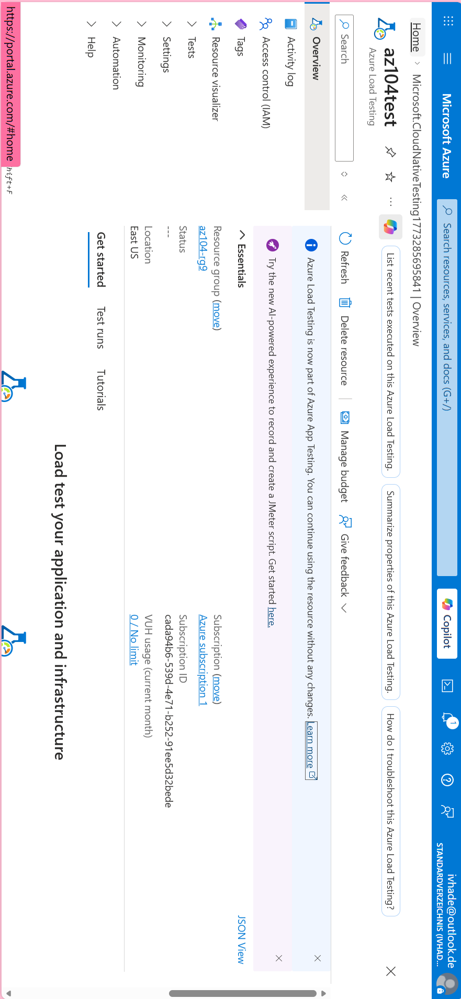
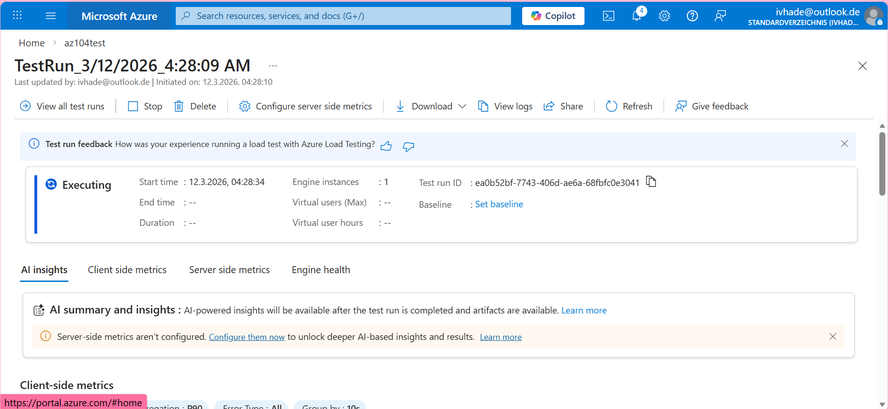

# azure-admin-labs
az-104 lab portfolio: identity, networking, compute, storage, monitoring, governance (scripts, screenshots, cleanup)
# Lab 09a- Implement Web Apps

## Goal 
Build and validate Azure App Service skills by :
- Creating an **App Service Plan** and a **Web App** with the appropriate runtime stack,
- Deploying a sample web application to **App Service** and verifying it via the public URL,
- Practicing basic App Service configuratio; application setting, deployment options and platform features,
- Observing how App Service resources are managed and monitoredin the **Azure Portal** (overview, logs/metrics, and deployment status).

## What I did
- Created an ** App Service Plan** to host the web workload with a suitable pricing tier for the lab,
- provisioned a **Web App (App Service)**  and confirmed that it was working from the overview blade,
- Deployed a sample application to the lab's Web App using the recommended approach,
- Verified the deployment by browsing to the Web App's **default hostname** and confirmed the expected page rendered,
- Reviewed key configuration areas to understand how changes affect the running of the app eg, swapping, scaling and running tests

## Evidence
- 
- 
- 
- 
- 
- 
- 
- 
- 
- 
- 

