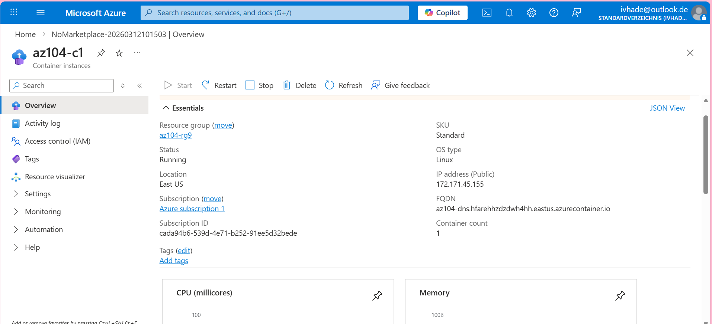
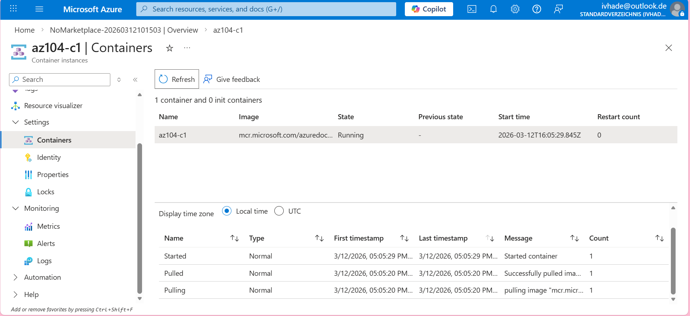
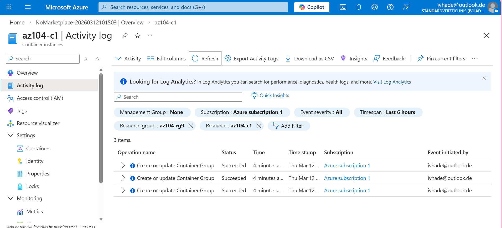
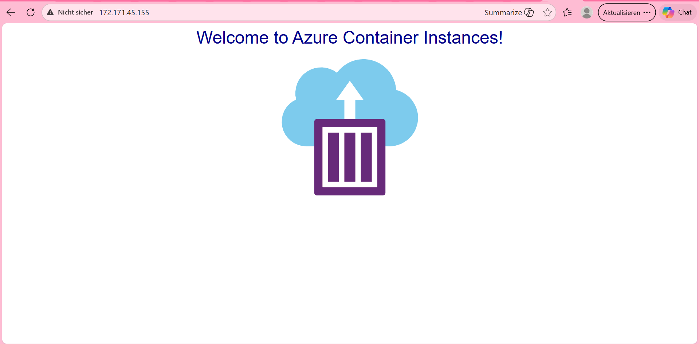
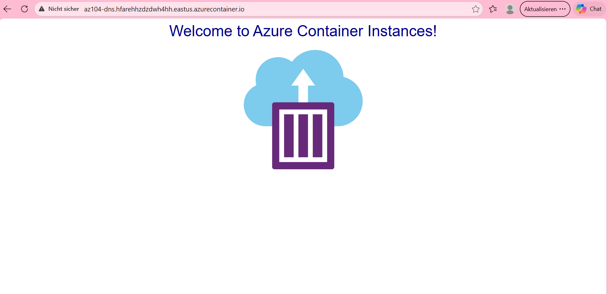
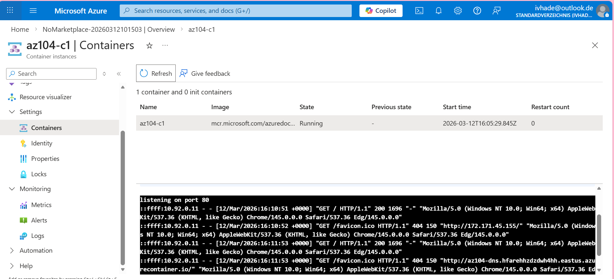

# azure-admin-labs
az-104 lab portfolio: identity, networking, compute, storage, monitoring, governance (scripts, screenshots, cleanup)
# Lab 09b- Implement Azure Container Instances

## Goal 

Implement and deploy Azure Container Instance by:
- Deploy **Azure Container Instance** using **Docker Image**
- Test and verify deployment of Azure Container Instance.

## What I did

- Searched and created Azure Container Instance,
- Review the deployed Conatiner Instance,
- Navigated the container using **DNS** name,
- verified the value of the container instance using the **IP Address** and the Container Instance **FQDN**
- Ensured that the **Welcome to Azure Container Instance** page is displayed,
- Checked and verified the log entries representing HTTP GET request generated by displaying the application in the browser.

## Evidence
- 
- 
- 
- 
- 
- 

