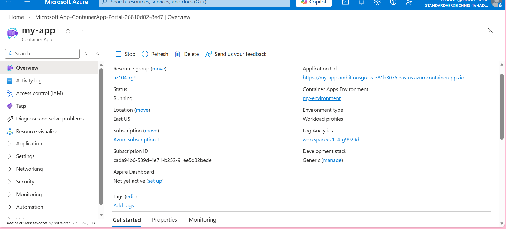
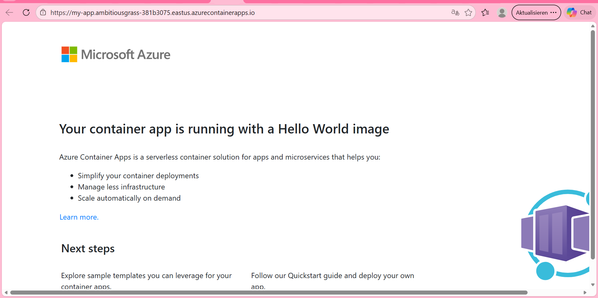
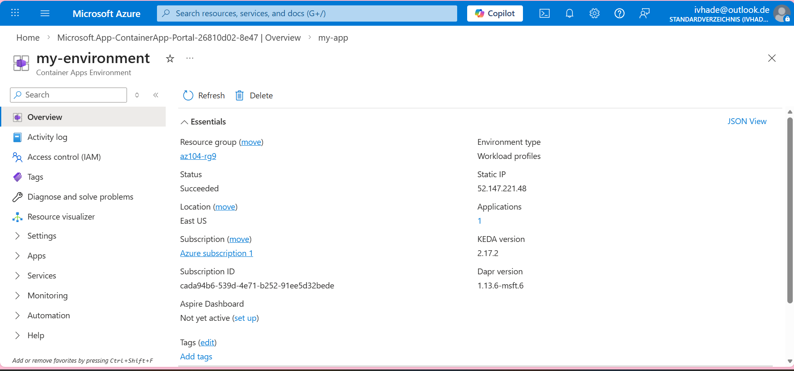
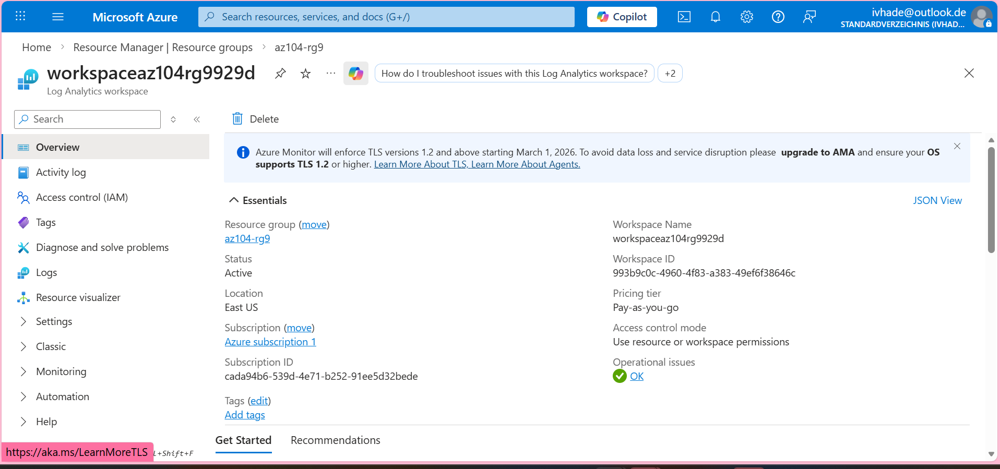
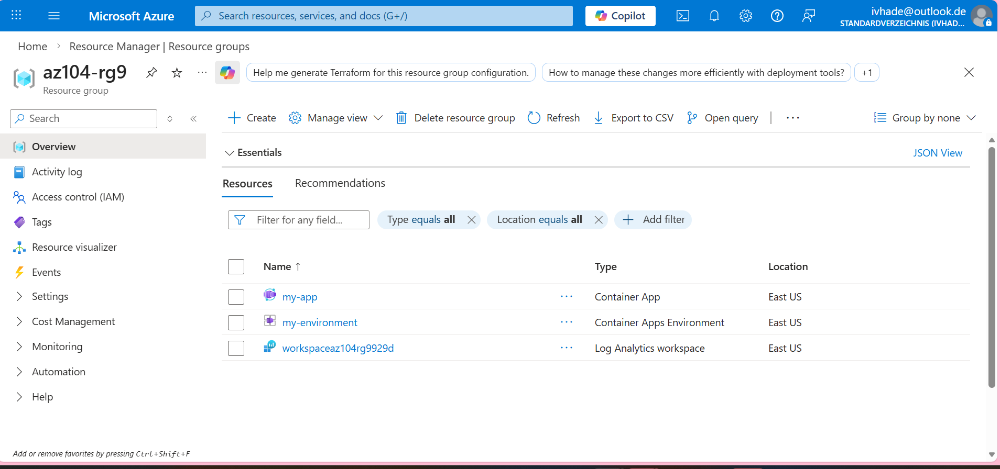

# azure-admin-labs
az-104 lab portfolio: identity, networking, compute, storage, monitoring, governance (scripts, screenshots, cleanup)
# Lab 09c - Implement Azure Container Apps

## Goal 
To implement and deploy Azure Container App by:
- Creating and configuring an **Azure Container App** and **Environment**
- Test and verify the deployment of the Azure Container App

## What I did
- Searched and created a **Container App**,
- Configured my **environment**,
- Verified the deployment of the container app,
- Ensure that the container app is live via the **application URL**
- Checked the log analytics and reviewed the **workspace**

## Evidence
- 
- 
- 
- 
- 

