# azure-admin-labs
az-104 lab portfolio: identity, networking, compute, storage, monitoring, governance (scripts, screenshots, cleanup)
# Lab 10 - Implement Data Protection
Implement theprotection of data by:
- backing up and recovery of **Azure Virtual Machines**
- Creating a **Recovery Services Vaults** and a **backup policy** for Azure Virtual Mahines
- Disaster recovery with **Azure Site Recovery**

## Goal 
- Use **Azure Deploy a Custom Template** services to provision an infrastructure i.e., Virtual Machine , NIC etc,
- Create and configure a Recovery Services vault,
- Configure backup for an Azure resource,
- Monitor the backup,
- Enable **Virtual Machine** replication.

## What I did
- Created a virtual machine using a custom template ,
- created and configured a **Recovery Services Vaults**,
- Created and configured **Virtual Machine** level **Backup**,
- Created a new **Backup Policy** and attached it to the virtual machine,
- Monitored back up by creating a **Storage Account** ,
- Configured the  **diagnostic settings** of the Recovery Services vault and archived back up data to the storage account,
- Enabled and configured virtual machine **Replication**
- Viewed and reviewed **Replicated Items** on **Protected Items**.

## Evidence
- 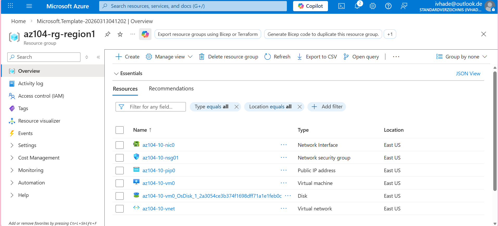
- 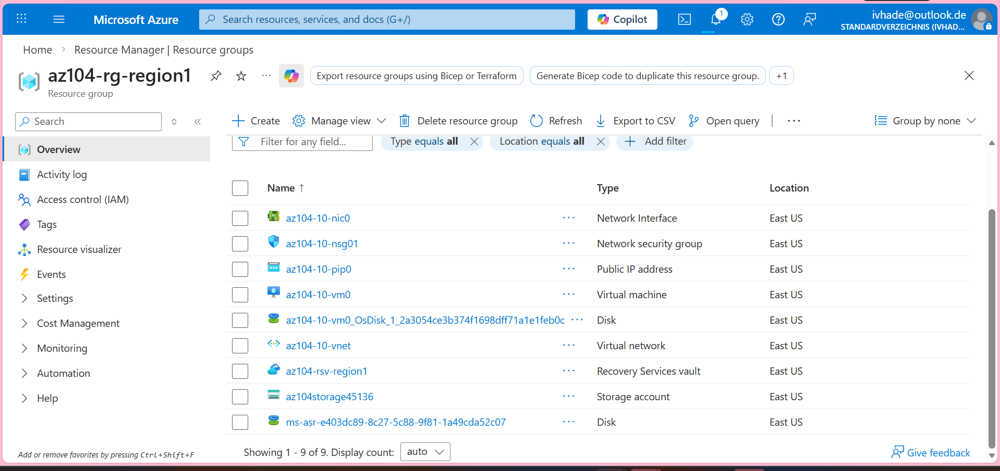
- 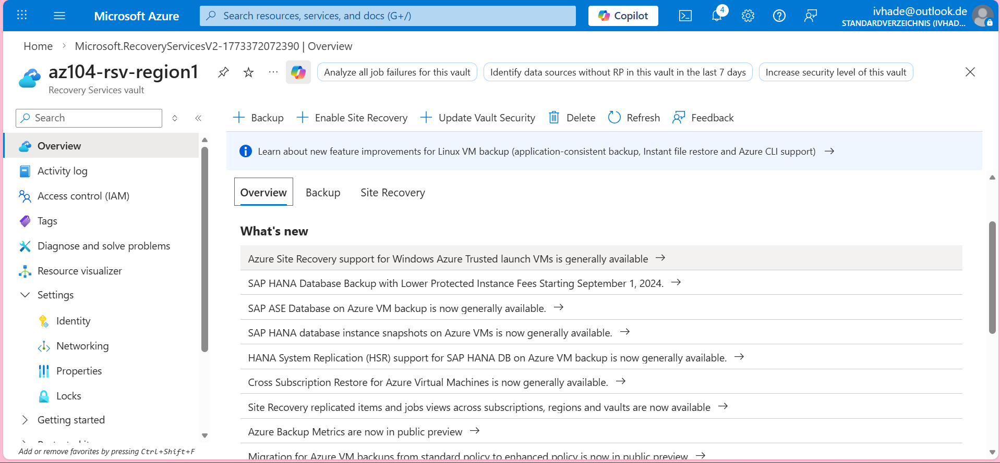
- 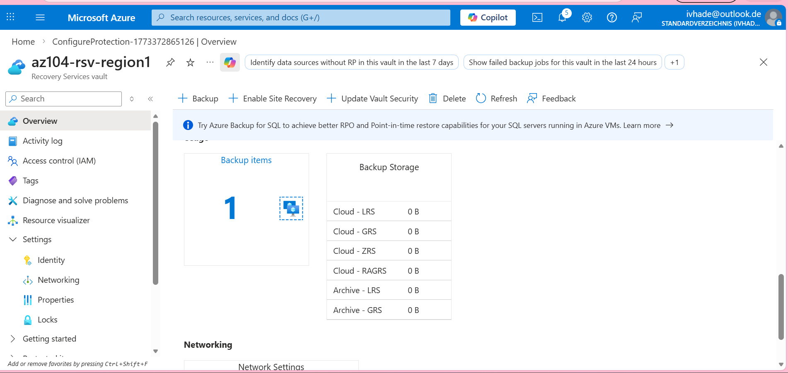
- 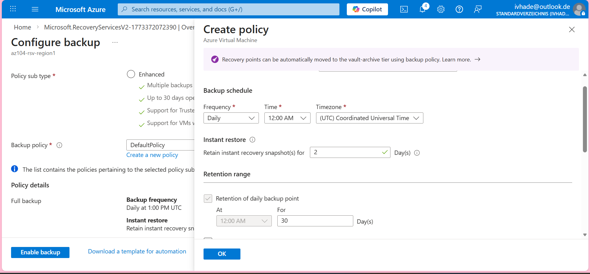
- 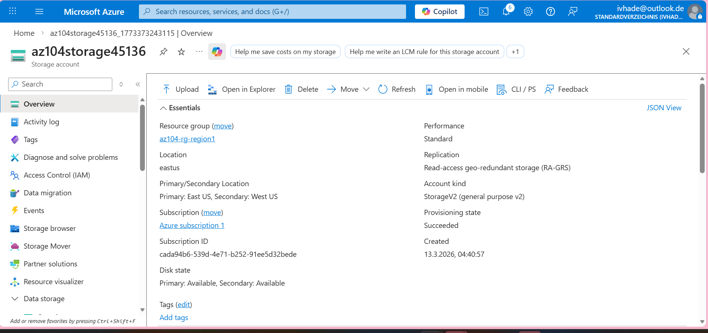
- 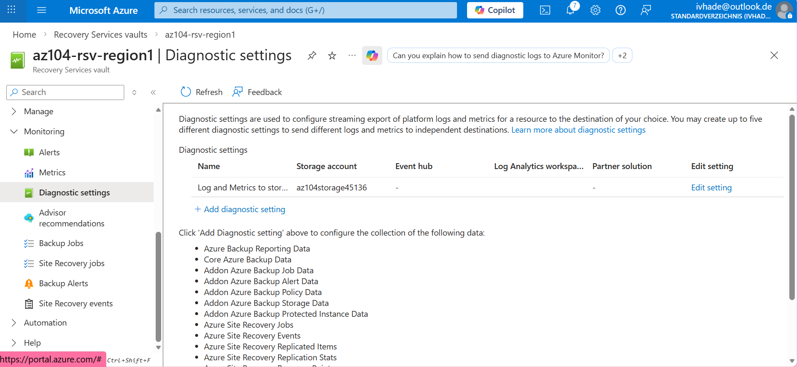
- 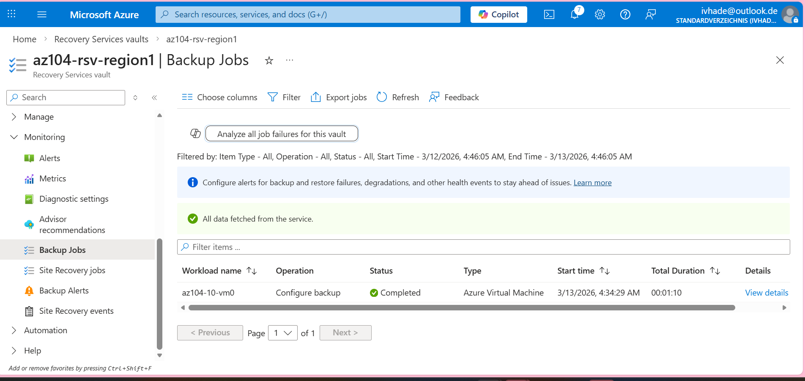
- 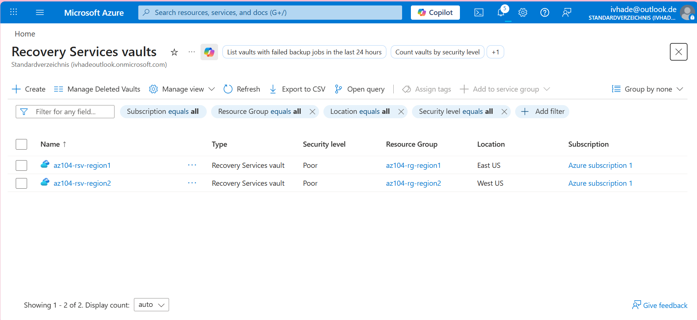
- 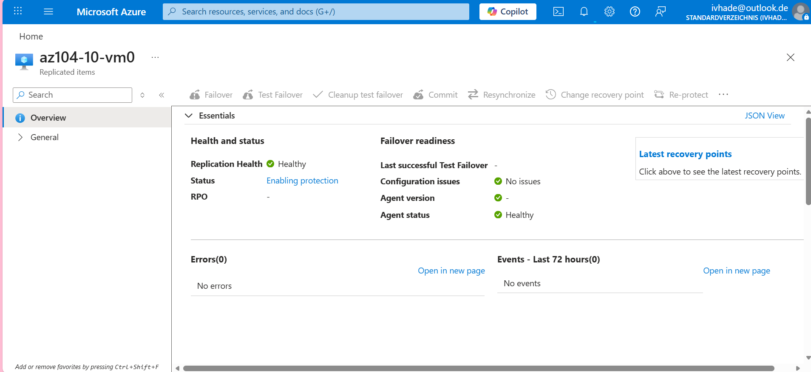
- 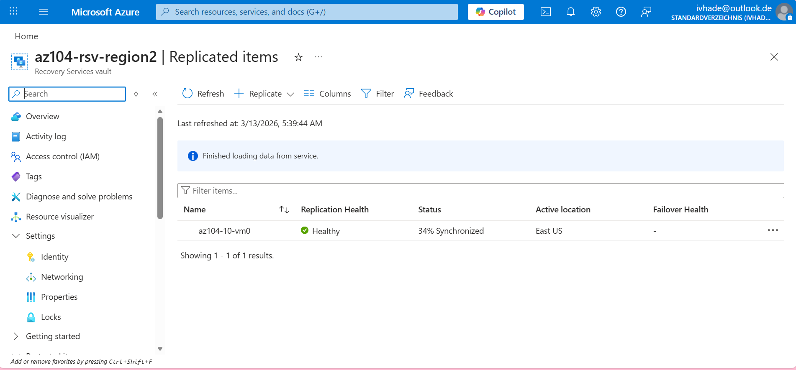
- 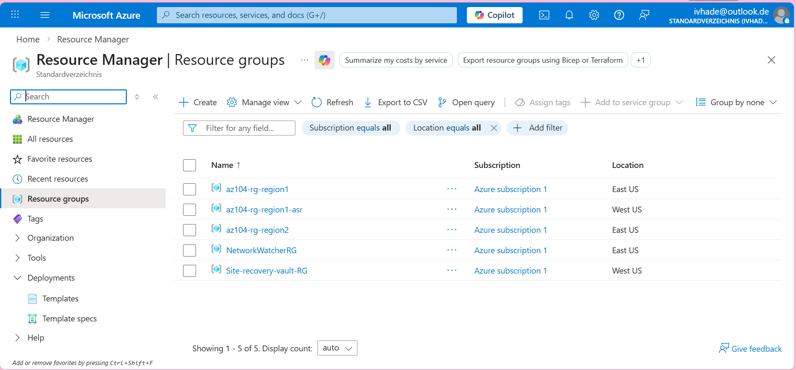

