# azure-admin-labs
az-104 lab portfolio: identity, networking, compute, storage, monitoring, governance (scripts, screenshots, cleanup)
# Lab 11 - Implement Monitoring

## Goal 
- Enable end-to-end monitoring for Azure resources using **Azure Monitor**
- Create **log queries** and use them to validate telemetry (activity, metrics and log data)
- Build alerting with **Alert rules**, **Action Groups**, and **Alert processing rules**,
- Trigger a test condition and confirm the alert fires and the notification is received.

## What I did

- Deployed a **Virtual Machine** using a custom template,
- Enabled virtual machine monitoring on **Monitor**,
- Created and configure an **Alert** by creating an **Alert Rule**,
- Configured **Action Group** so I am able to get notified if there are any changes to my infrastruture,
- Tested my configuration by deleting the virtual machine,
- Configured an **Alert Processing Rule**,
- Used **Azure Monitor Log Queries** to count virtual machine **heartbeat**,
- Used the heartbeat table by deploying the **KQL Mode**

## Evidence
- 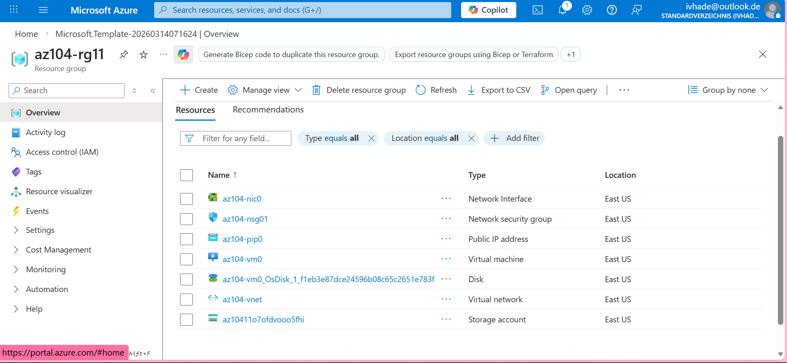
- 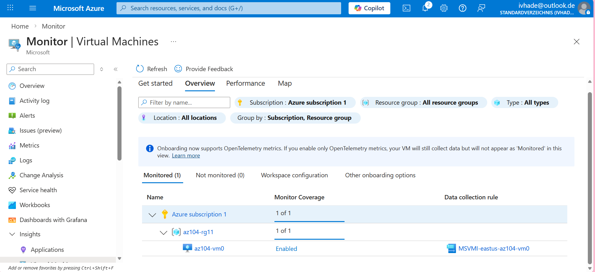
- 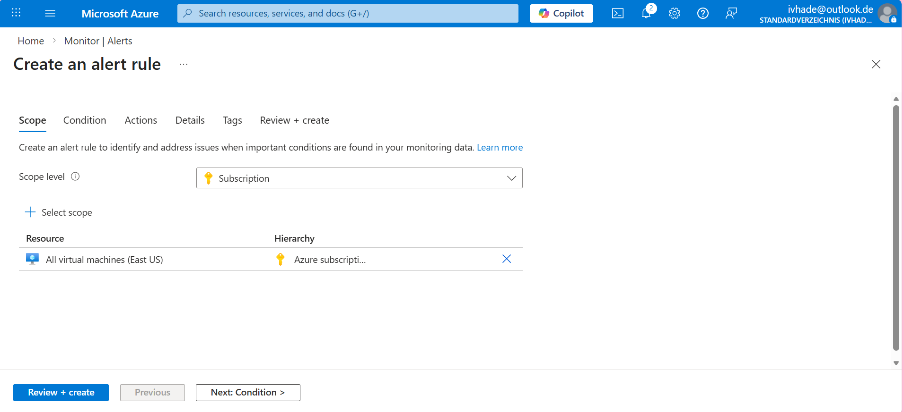
- 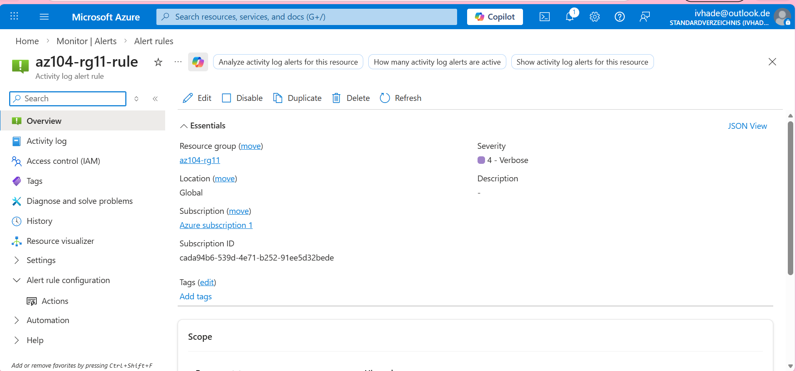
- 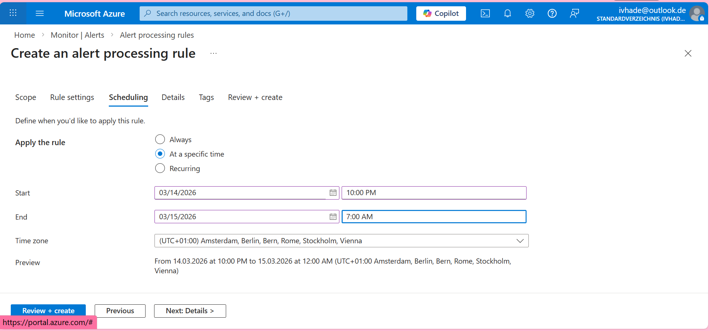
- 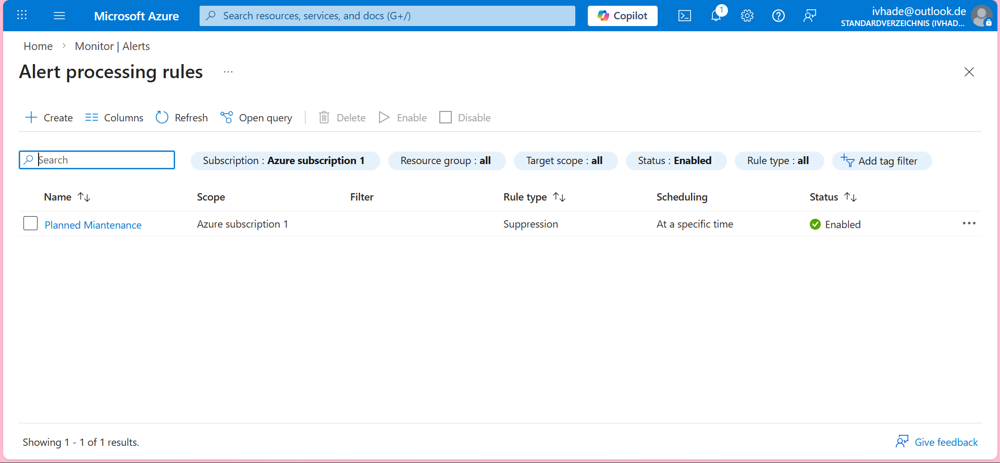
- 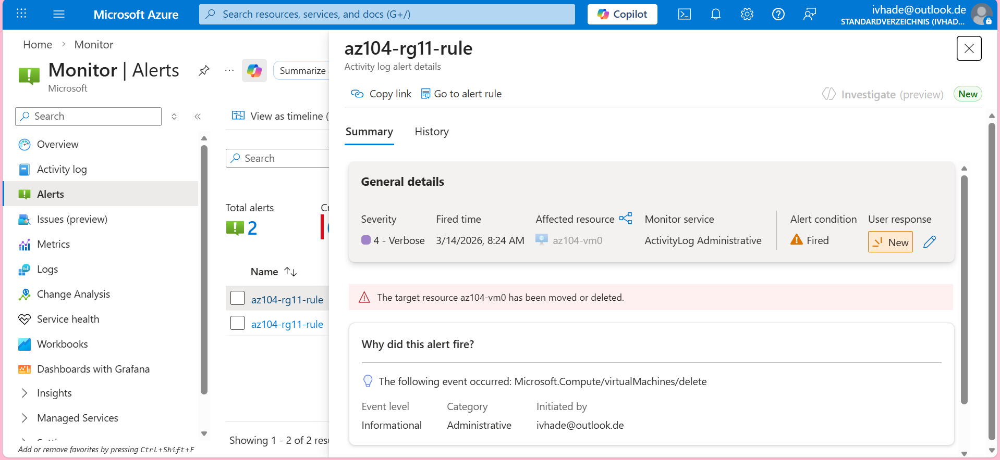
- 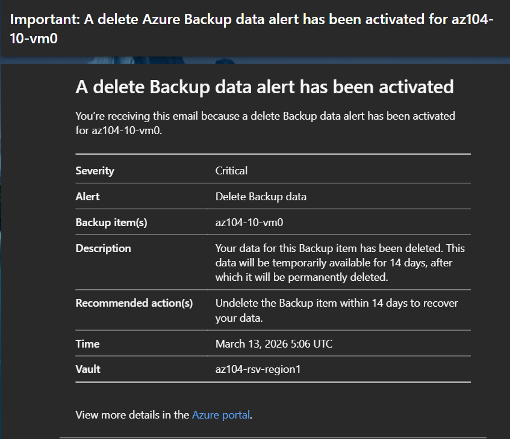
- 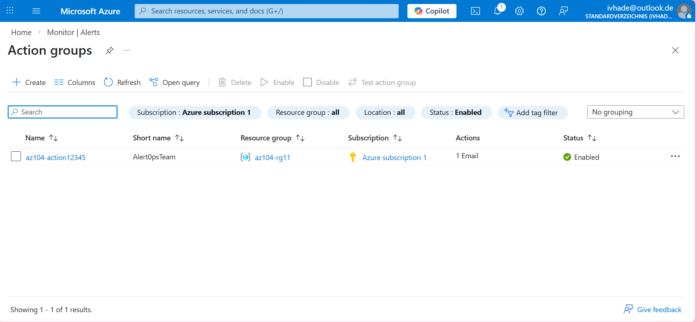
- 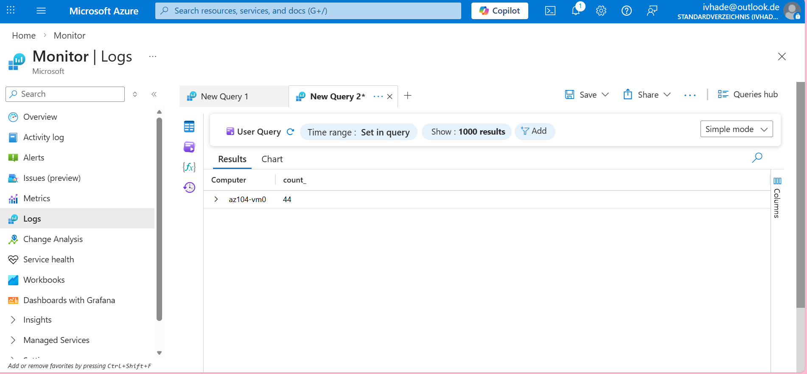
- 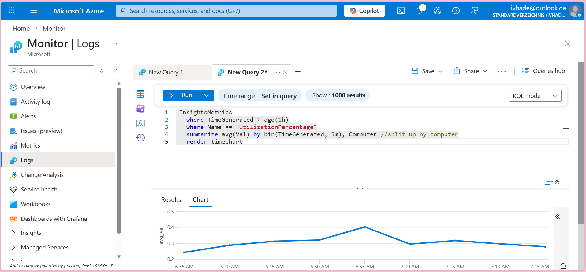

