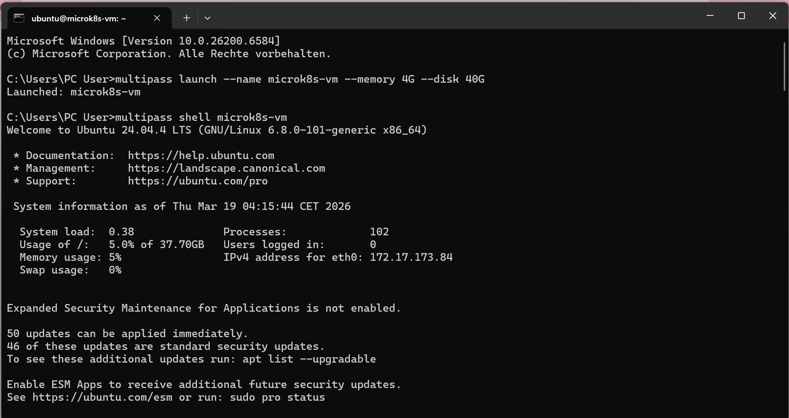
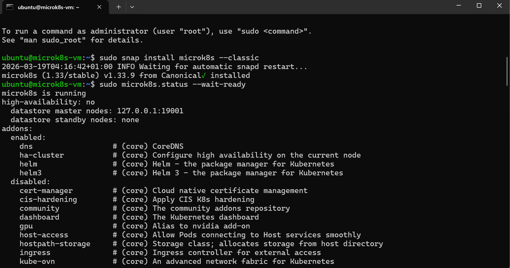
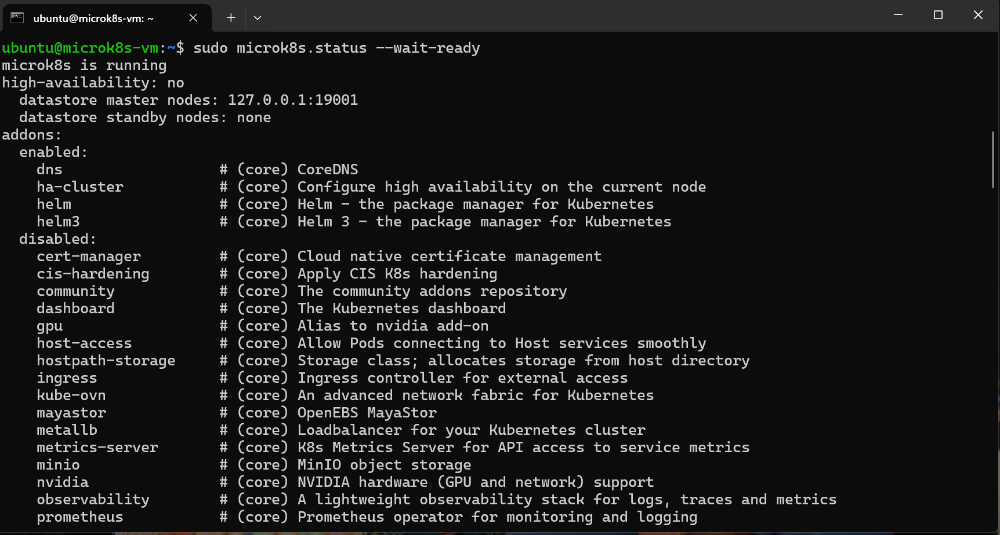
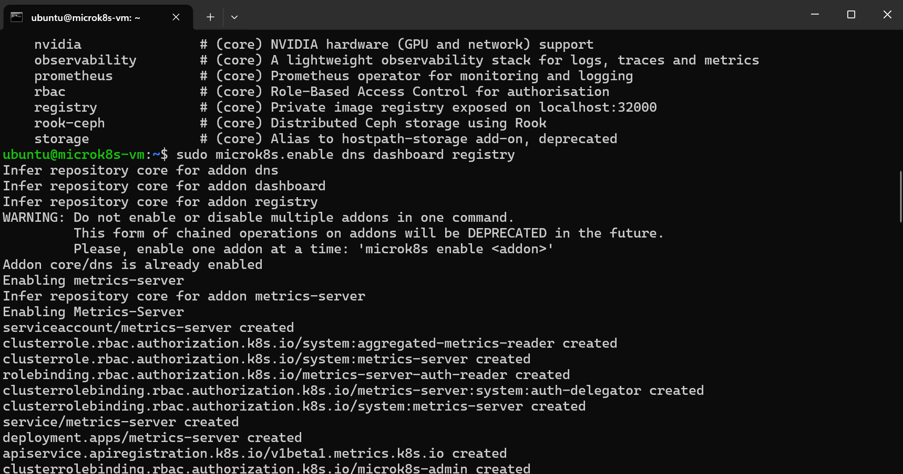
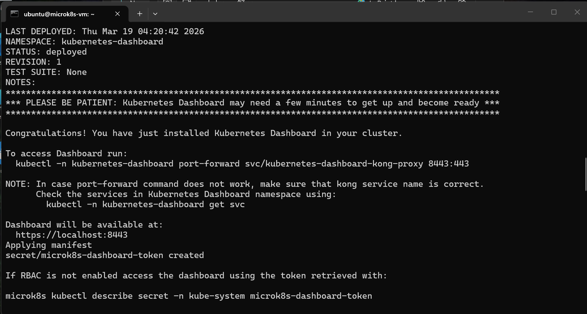
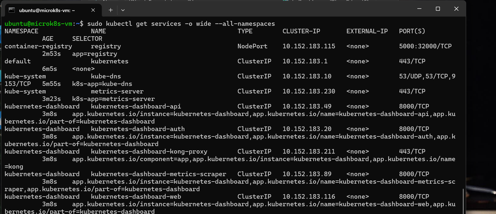
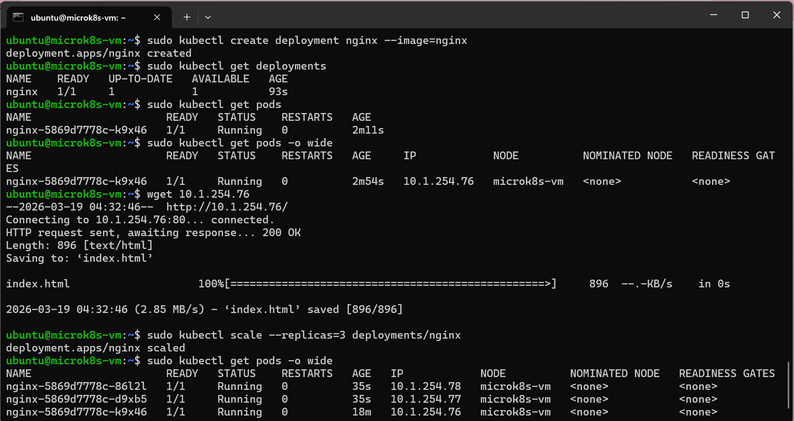

# azure-admin-labs
az-104 lab portfolio: identity, networking, compute, storage, monitoring, governance (scripts, screenshots, cleanup)
# Lab 12 -Kubernetes Installation

## Goal 
-  explore a Kubernetes installation with a single-node cluster,
- configure and install a MicroK8s environment that's easy to set up and tear down,
- deploy a Kubernetes service and scale it out to multiple instances to host a website.

## What I did
- Downloaded and installed the latest release of Multipass for Windows from Github (https://github.com/canonical/multipass/releases).
- ran the Multipass launch command to configure and run the microk8s-vm image.
- ran the multipass shell microk8s-vm command to access the VM instance.
- Installed the MicroK8s snap app,
- viewed the status of the installed add-ons on your cluster,
- enabled the DNS, Dashboard, and Registry add-ons,
- checked the nodes that are running in your cluster,
- Fetched all the services installed,
- scheduled a web server on the cluster to serve a website to your customers. 
- installed and accessed website,
- scaled the pod to 3,
- checked the number of pods running

## Evidence
- 
- 
- 
- 
- 
- 
- 