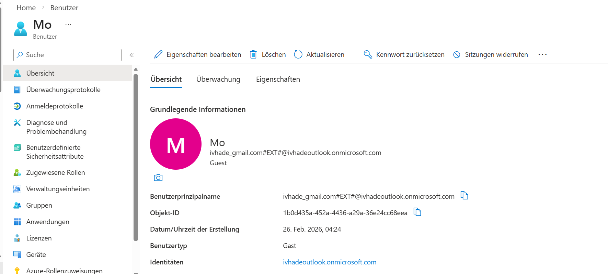

# azure-admin-labs
az-104 lab portfolio: identity, networking, compute, storage, monitoring, governance (scripts, screenshots, cleanup)
# Lab 01 - Entra ID Identities

## Goal
Create and manage Entra ID identities by creating a member user, inviting a guest user,(B2B), and 
assigning both to a security group. 

## What I did
- Created a new Entra ID user (member) for the IT department.
- Invited an external user as a guest (B2B) to the tenant.
- Created an Entra ID group called **IT Department**
- Added both accounts (the member user and the guest user) to the **IT Department** group

## Evidence
 - 
 - 
 - 
 - 
 